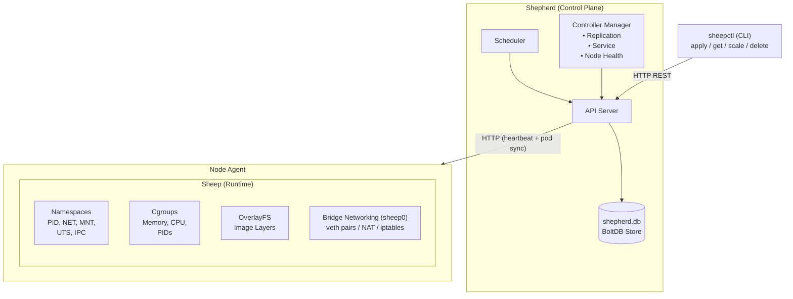

# Sheep & Shepherd

A container runtime and orchestration platform built from scratch in Go.

**Sheep** is a container runtime (analogous to Docker) that uses Linux namespaces, cgroups v2, and overlayfs to provide process isolation.

**Shepherd** is a container orchestrator (analogous to Kubernetes) that schedules and manages containerized workloads across a cluster of nodes.

## Architecture



## Project Structure

```
sheep/
├── cmd/
│   ├── sheep/          # Container runtime CLI
│   ├── shepherd/       # Orchestrator daemon
│   └── sheepctl/       # Orchestrator client CLI
├── internal/
│   ├── container/      # Container runtime core
│   │   ├── container.go      # Types and ID generation
│   │   ├── manager.go        # Container lifecycle manager
│   │   ├── runtime_linux.go  # Linux namespaces, cgroups, pivot_root
│   │   ├── runtime_stub.go   # Non-Linux stub
│   │   ├── image.go          # Image import, bootstrap, management
│   │   ├── network_linux.go  # Bridge networking, veth
│   │   └── network_stub.go   # Non-Linux stub
│   ├── shepherd/       # Orchestrator core
│   │   ├── types.go          # Pod, Service, Deployment, Node types
│   │   ├── store.go          # BoltDB persistent state store
│   │   ├── apiserver.go      # REST API server
│   │   ├── scheduler.go      # Pod scheduler (filter + score)
│   │   ├── controller.go     # Replication, Service, Node controllers
│   │   └── agent.go          # Node agent
│   └── cli/
│       └── table.go          # CLI table formatter
├── examples/           # Example resource definitions
├── docs/               # Architecture and design documentation
├── Makefile
└── go.mod
```

## Requirements

- **Build**: Go 1.23+ (compiles on any OS)
- **Runtime**: Linux kernel 5.x+ with cgroups v2 enabled
- **Privileges**: `sheep` requires root (for namespaces, cgroups, networking)

## Quick Start

### Build

```bash
make build
# Produces: bin/sheep, bin/shepherd, bin/sheepctl
```

### Sheep (Container Runtime)

```bash
# Create a minimal base image from host binaries
sudo ./bin/sheep bootstrap minimal

# Run a container
sudo ./bin/sheep run --name hello -m 128m minimal /bin/echo "Hello from Sheep!"

# Run interactively
sudo ./bin/sheep run --name shell minimal /bin/sh

# List containers
sudo ./bin/sheep ps -a

# Stop and remove
sudo ./bin/sheep stop hello
sudo ./bin/sheep rm hello

# List images
sudo ./bin/sheep images
```

### Shepherd (Orchestrator)

```bash
# Start in standalone mode (API server + agent in one process)
sudo ./bin/shepherd --mode standalone

# In another terminal:
export SHEPHERD_API=localhost:9876

# Create a pod
./bin/sheepctl apply -f examples/pod.json

# List pods
./bin/sheepctl get pods

# Create a deployment with 3 replicas
./bin/sheepctl apply -f examples/deployment.json

# Scale up
./bin/sheepctl scale deployment/web --replicas=5

# View cluster state
./bin/sheepctl nodes
./bin/sheepctl events

# Clean up
./bin/sheepctl delete pod web-server
./bin/sheepctl delete deployment web
```

### Multi-Node Cluster

```bash
# Node 1: Start the control plane
sudo ./bin/shepherd --mode server --addr :9876

# Node 2: Start an agent
sudo ./bin/shepherd --mode agent --node-name worker-1 --api-addr 10.0.0.1:9876

# Node 3: Start another agent
sudo ./bin/shepherd --mode agent --node-name worker-2 --api-addr 10.0.0.1:9876
```

## CLI Reference

### Sheep — container runtime

#### Container Commands

| Command | Syntax | Description |
|---------|--------|-------------|
| `run` | `sheep run [opts] <image> <cmd>` | Create and start a container |
| `create` | `sheep create [opts] <image> <cmd>` | Create a container without starting |
| `start` | `sheep start <container>` | Start a stopped container |
| `stop` | `sheep stop <container>` | Stop a running container |
| `rm` | `sheep rm <container> [...]` | Remove one or more containers |
| `ps` | `sheep ps [-a]` | List containers (`-a` includes stopped) |
| `inspect` | `sheep inspect <container>` | Show container details (ID, PID, IP, resources) |
| `logs` | `sheep logs <container>` | Show container stdout/stderr output |

#### Image Commands

| Command | Syntax | Description |
|---------|--------|-------------|
| `pull` | `sheep pull <image>[:<tag>]` | Pull image from registry (Docker Hub, Meadow, any OCI) |
| `push` | `sheep push <registry/repo:tag>` | Push local image to a registry |
| `tag` | `sheep tag <source> <target>` | Create a new tag for an existing image |
| `images` | `sheep images` | List all local images |
| `import` | `sheep import <name> <tarball>` | Import a rootfs `.tar.gz` as an image |
| `bootstrap` | `sheep bootstrap [name]` | Create minimal image from host binaries |
| `rmi` | `sheep rmi <image>` | Remove an image |

#### Run Options

| Flag | Example | Description |
|------|---------|-------------|
| `--name` | `--name web` | Container name |
| `-d` | `-d` | Detach (run in background) |
| `-m` | `-m 256m` | Memory limit (`k`, `m`, `g`) |
| `--cpu-shares` | `--cpu-shares 512` | CPU relative weight |
| `--cpu-quota` | `--cpu-quota 50000` | CPU quota (microseconds per 100ms period) |
| `--pids-limit` | `--pids-limit 100` | Maximum number of processes |
| `--hostname` | `--hostname myhost` | Container hostname |
| `-e` | `-e KEY=VALUE` | Set environment variable (repeatable) |
| `-v` | `-v /host:/ctr:ro` | Volume mount (`:ro` = read-only) |
| `-w` | `-w /app` | Working directory inside container |

#### Environment Variables

| Variable | Default | Description |
|----------|---------|-------------|
| `SHEEP_DATA_DIR` | `/var/lib/sheep` | Data directory for images, containers, overlays |

### Sheepctl — orchestrator CLI

#### Resource Commands

| Command | Syntax | Description |
|---------|--------|-------------|
| `apply` | `sheepctl apply -f <file.json>` | Create or update a resource from JSON |
| `get` | `sheepctl get <resource> [name]` | List or get a specific resource |
| `delete` | `sheepctl delete <resource> <name>` | Delete a resource |
| `describe` | `sheepctl describe <resource> <name>` | Show detailed resource info (JSON) |
| `scale` | `sheepctl scale deployment/<name> --replicas=N` | Scale a deployment up or down |
| `logs` | `sheepctl logs <pod>` | Show pod container info |
| `nodes` | `sheepctl nodes` | List cluster nodes |
| `events` | `sheepctl events` | Show cluster events |
| `info` | `sheepctl info` | Show cluster summary |

#### Resource Types

| Resource | Aliases | Description |
|----------|---------|-------------|
| `pods` | `pod`, `po` | Smallest schedulable unit |
| `services` | `service`, `svc` | Service discovery / endpoint routing |
| `deployments` | `deployment`, `deploy` | Manages pod replicas with auto-scaling |
| `nodes` | `node`, `no` | Cluster worker nodes |

#### Flags and Environment

| Flag / Env | Default | Description |
|------------|---------|-------------|
| `-n`, `--namespace` | `default` | Target namespace |
| `SHEPHERD_API` | `localhost:9876` | Shepherd API server address |

### Shepherd — orchestrator daemon

| Flag | Default | Description |
|------|---------|-------------|
| `--mode` | `server` | Run mode: `server`, `agent`, or `standalone` |
| `--addr` | `:9876` | API server listen address |
| `--data-dir` | `/var/lib/shepherd` | Data directory (BoltDB store) |
| `--node-name` | hostname | Node name (agent mode) |
| `--api-addr` | — | API server address to connect to (agent mode, required) |

#### Run Modes

| Mode | Description |
|------|-------------|
| `server` | Control plane only: API server, scheduler, controllers |
| `agent` | Node agent only: registers with control plane, manages containers |
| `standalone` | Both server + agent in a single process (for dev/single-node) |

### Meadow — image registry

| Flag | Default | Description |
|------|---------|-------------|
| `--addr` | `:5555` | Listen address |
| `--data-dir` | `/var/lib/meadow` | Storage directory for blobs and manifests |

#### API Endpoints

| Method | Path | Description |
|--------|------|-------------|
| `GET` | `/v2/` | Version check (OCI standard) |
| `GET` | `/v2/_catalog` | List all repositories |
| `GET` | `/v2/{name}/tags/list` | List tags for a repository |
| `HEAD/GET` | `/v2/{name}/blobs/{digest}` | Check / download a blob |
| `POST` | `/v2/{name}/blobs/uploads?digest=` | Upload a blob |
| `GET/PUT/DELETE` | `/v2/{name}/manifests/{ref}` | Pull / push / delete a manifest |
| `GET` | `/meadow/stats` | Registry summary (repo count, sizes) |
| `GET` | `/meadow/stats/{name}` | Per-repository stats |

## Documentation

- **[Getting Started](docs/getting-started.md)** — збірка, створення образів, запуск застосунків, оркестрація
- [Architecture Overview](docs/architecture.md) — system design, component diagrams
- [Sheep Internals](docs/sheep-internals.md) — container runtime: namespaces, cgroups, overlayfs, networking
- [Shepherd Internals](docs/shepherd-internals.md) — orchestrator: scheduler, controllers, reconciliation loops
- [Data Model](docs/data-model.md) — entity diagrams, storage schema, filesystem layout

## Useful Resources

### Linux Container Primitives

- [Linux namespaces — man 7 namespaces](https://man7.org/linux/man-pages/man7/namespaces.7.html) — основа ізоляції процесів
- [Control Groups v2 — kernel docs](https://docs.kernel.org/admin-guide/cgroup-v2.html) — обмеження ресурсів (memory, CPU, PIDs)
- [OverlayFS — kernel docs](https://docs.kernel.org/filesystems/overlayfs.html) — шарувата файлова система для образів
- [pivot_root(2) — man page](https://man7.org/linux/man-pages/man2/pivot_root.2.html) — зміна кореневої файлової системи контейнера
- [veth(4) — man page](https://man7.org/linux/man-pages/man4/veth.4.html) — віртуальні Ethernet-пари для мережі контейнерів

### Container Runtime & Standards

- [OCI Runtime Specification](https://github.com/opencontainers/runtime-spec) — стандарт запуску контейнерів
- [OCI Image Specification](https://github.com/opencontainers/image-spec) — стандарт формату образів
- [OCI Distribution Specification](https://github.com/opencontainers/distribution-spec) — стандарт registry API (реалізований у Meadow)
- [runc](https://github.com/opencontainers/runc) — еталонна реалізація OCI runtime
- [Containers from scratch — Liz Rice](https://www.youtube.com/watch?v=8fi7uSYlOdc) — як написати контейнерний runtime на Go з нуля

### Orchestration

- [Kubernetes Architecture](https://kubernetes.io/docs/concepts/architecture/) — архітектура, що надихнула Shepherd
- [Kubernetes Scheduler](https://kubernetes.io/docs/concepts/scheduling-eviction/kube-scheduler/) — модель планування filter + score
- [Controllers and Reconciliation](https://kubernetes.io/docs/concepts/architecture/controller/) — патерн reconciliation loop

### Go Libraries

- [bbolt](https://github.com/etcd-io/bbolt) — embedded key/value сховище (BoltDB), що використовується в Shepherd
- [Go syscall package](https://pkg.go.dev/syscall) — системні виклики для namespaces та mount

## License

MIT
