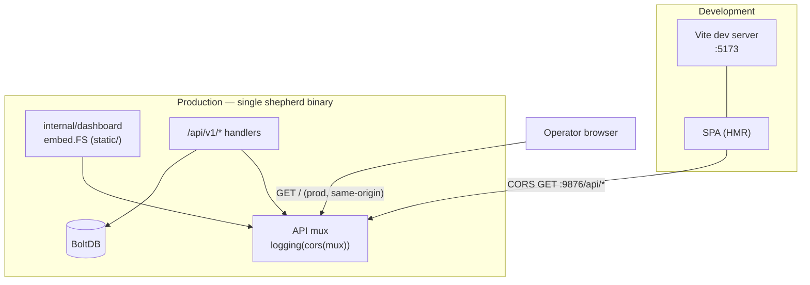

# ADR-0001: Dashboard Stack — Embedded React/Vite SPA

- **Status:** Proposed
- **Author(s):** i.gorovoy
- **Created At:** 2026-07-01
- **Approved At:** —
- **Epic:** Cluster Dashboard
- **Related Tasks:** —
- **Reviewers:** TBD

## Table of Contents

- [Context](#context)
- [Decision](#decision)
- [Rationale](#rationale)
- [Fault Tolerance](#fault-tolerance)
- [Impact](#impact)
- [Infrastructure](#infrastructure)
- [Security](#security)
- [Resources](#resources)

## Context

Shepherd had no frontend. The whole tree is Go, built from scratch with a
"one binary per component" ethos and no runtime dependencies beyond the Go
toolchain (BoltDB is a Go library). RFC-0001 proposes a read-only cluster
dashboard. We must choose a stack for it without breaking:

- the **single-binary** deployment model,
- the **API server as the single writer** to the store,
- the from-scratch, low-external-dependency spirit,

while leaving room for the planned farm-themed **pasture** visualization
(RFC-0002), which is interactive/animated and needs a real frontend surface.

## Decision

Build the dashboard as a **React 18 + Vite 5 + TypeScript single-page
application**, and **embed the built assets into the `shepherd` binary via
`//go:embed`**, served by the existing API server:

- Frontend lives in `web/`; only extra runtime dependency is
  `react-router-dom`.
- Package `internal/dashboard` embeds `static/` (`//go:embed static`) and
  serves it with **SPA fallback** (non-file path → `index.html`), mounted at
  `/`. API routes (`/api/...`, `/healthz`) take precedence.
- A typed API client reads `VITE_SHEPHERD_API` (default
  `http://localhost:9876`) and **polls** each resource endpoint (~5s) with a
  manual refresh.
- **Dev-time CORS**: the API mux is wrapped `api.logging(api.cors(mux))` with
  `Access-Control-Allow-Origin: *`, methods `GET, OPTIONS`, preflight → 204, so
  the Vite dev server on `:5173` can call the API on `:9876`. In production the
  SPA is same-origin.

## Rationale

**vs. Go `html/template` (server-rendered):** Templates keep everything in Go
and same-origin, but make client-side routing, live polling without full
reloads, and especially the animated pasture view awkward. The dashboard is an
evolving, interactive read UI; a component-based SPA fits far better.

**vs. standalone SPA (separately deployed):** A separate service breaks the
single-binary model, adds its own deploy/lifecycle, and needs CORS or a proxy
permanently. Embedding via `go:embed` gives us the SPA's richer ecosystem
*while still shipping one binary*.

**Why React/Vite/TS specifically:** the planned pasture visualization
(node → pen, pod → sheep, monochrome phase states, animation) benefits from a
mature component/animation ecosystem and type safety against the API contract.
The accepted cost is a JS/npm toolchain and a build step — contained behind
`make dashboard` and `make web-build`, which **skip gracefully** when npm or
`web/` is absent (a placeholder `index.html` is committed so Go always builds).

## Fault Tolerance

- **Read-only:** the SPA issues only `GET`s; it cannot corrupt cluster state.
  The API server remains the single writer to BoltDB.
- **API unreachable:** the client surfaces a graceful error (health check +
  error banner) and keeps the last successful snapshot on screen; it retries on
  the next poll. No crash, no blank screen.
- **Single binary:** embedding means there is no separate frontend process to
  fail, version-skew, or deploy independently; the SPA can never be newer or
  older than the `shepherd` that serves it.
- **Build resilience:** missing npm/`web/` degrades to the committed placeholder
  rather than failing `go build`.
- **Blast radius:** confined to the `/` handler and a read path; API resource
  handlers, scheduler, controllers, and the store are untouched.

## Impact

- New tree `web/` (React/Vite/TS) and package `internal/dashboard`.
- New aggregate endpoint `GET /api/v1/cluster/summary`.
- CORS middleware added to the API server handler chain.
- Larger `shepherd` binary (embedded assets) — small and acceptable.
- Contributors touching the dashboard need Node/npm; contributors touching only
  Go do not (graceful skip + placeholder).

## Infrastructure

- **Embedding:** `//go:embed static` in `internal/dashboard`; `fs.Sub` +
  `http.FileServer` with SPA fallback.
- **Build targets:**
  - `web-build` — `npm install && vite build` in `web/`; skips if npm or `web/`
    is absent.
  - `dashboard` — runs `web-build`, copies `web/dist` → `internal/dashboard/static`,
    then `go build` shepherd with embedded assets.
- **CORS:** `Access-Control-Allow-Origin: *`, `Access-Control-Allow-Methods:
  GET, OPTIONS`, preflight `OPTIONS` → `204 No Content`.
- **Ports:** dev SPA `:5173` (Vite), API `:9876`; prod SPA is served on the
  same origin as the API (`:9876`).
- **Config:** `VITE_SHEPHERD_API` (default `http://localhost:9876`).

## Security

- Unauthenticated read of all cluster state; permissive but read-only CORS
  (`GET, OPTIONS`). Treat as trusted-network / loopback only until auth is
  added. Do not enable write actions without authn/authz.

## Resources

- `internal/dashboard/dashboard.go`, `internal/shepherd/apiserver.go`
- `web/`, `Makefile`
- RFC-0001 (`docs/rfc/RFC-0001-cluster-dashboard.md`)
- PD-0001 (`docs/pd/PD-0001-cluster-dashboard.md`)
