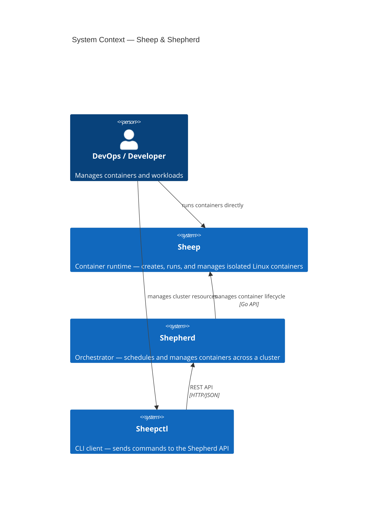
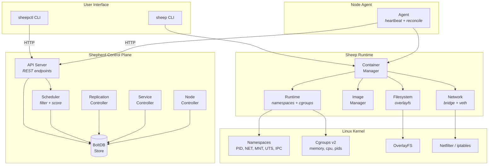
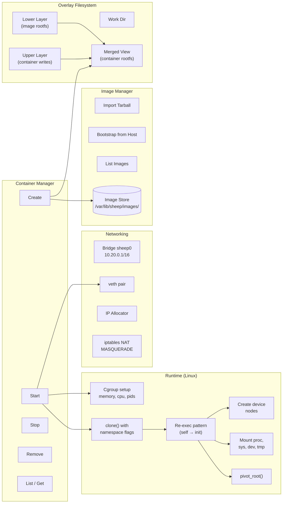
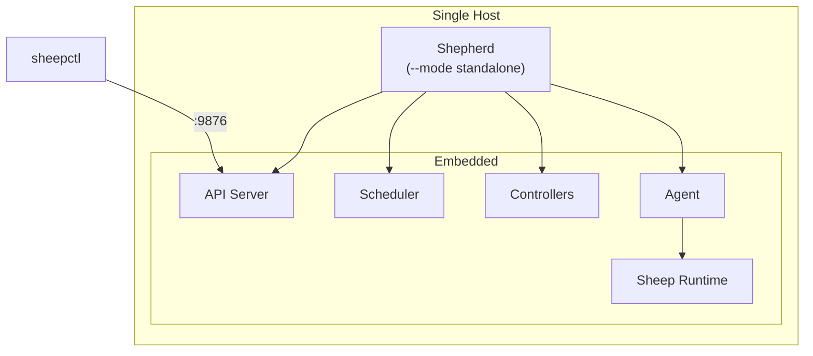
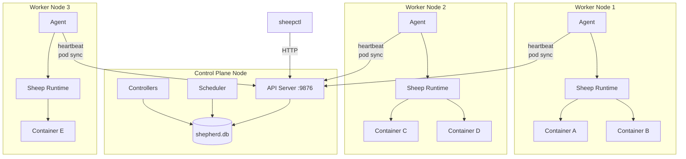

# Architecture Overview

## System Context

The Sheep/Shepherd platform consists of three user-facing binaries and two core subsystems.

## Component Architecture

### High-Level Component View

### Sheep Runtime Components

### Shepherd Control Plane Components

```mermaid
graph TB
    subgraph "API Server"
        PODS_EP["/api/v1/pods"]
        SVC_EP["/api/v1/services"]
        DEP_EP["/api/v1/deployments"]
        NODE_EP["/api/v1/nodes"]
        EVT_EP["/api/v1/events"]
    end

    subgraph "Scheduler"
        WATCH_P["Watch pending pods"]
        FILTER["Filter feasible nodes<br/><i>ready? heartbeat? resources?<br/>node selector?</i>"]
        SCORE["Score nodes<br/><i>least-loaded, resource balance</i>"]
        BIND["Bind pod → node"]
    end

    subgraph "Controllers"
        subgraph "Replication Controller"
            RC_WATCH["Watch deployments"]
            RC_COMPARE["Compare desired vs actual"]
            RC_SCALE["Create / delete pods"]
        end
        subgraph "Service Controller"
            SC_WATCH["Watch services"]
            SC_ENDPOINTS["Update endpoint list"]
        end
        subgraph "Node Controller"
            NC_WATCH["Monitor heartbeats"]
            NC_MARK["Mark NotReady"]
        end
    end

    subgraph "Store (BoltDB)"
        B_PODS[("pods")]
        B_SVC[("services")]
        B_DEP[("deployments")]
        B_NODES[("nodes")]
        B_EVT[("events")]
    end

    PODS_EP --> B_PODS
    SVC_EP --> B_SVC
    DEP_EP --> B_DEP
    NODE_EP --> B_NODES
    EVT_EP --> B_EVT

    WATCH_P --> B_PODS
    FILTER --> B_NODES
    BIND --> B_PODS

    RC_WATCH --> B_DEP
    RC_COMPARE --> B_PODS
    RC_SCALE --> B_PODS

    SC_WATCH --> B_SVC
    SC_ENDPOINTS --> B_PODS

    NC_WATCH --> B_NODES
```

## Deployment Topologies

### Standalone (Single Node)

### Multi-Node Cluster

## Technology Decisions

| Decision | Choice | Rationale |
|----------|--------|-----------|
| Language | Go 1.23 | System programming, concurrency, static binaries |
| Container isolation | Linux namespaces + cgroups v2 | Direct kernel primitives, no shim |
| Filesystem isolation | OverlayFS | Copy-on-write, standard in container runtimes |
| State store | BoltDB | Embedded, no external dependencies, transactional |
| API protocol | REST/JSON | Simple, debuggable, standard tooling |
| Build constraints | `//go:build linux` | Compile everywhere, run on Linux |
| Process isolation | Re-exec pattern | Required for Go's threading model with clone() |
| Networking | Bridge + veth + NAT | Standard container networking model |

## Comparison with Industry Standards

| Component | Sheep/Shepherd | Docker/Kubernetes |
|-----------|----------------|-------------------|
| Container runtime | `sheep` | `containerd` / `runc` |
| Image format | tar/gzip rootfs | OCI image spec |
| Orchestrator API | REST on `:9876` | kube-apiserver on `:6443` |
| State store | BoltDB (embedded) | etcd (distributed) |
| Scheduler | filter + score | predicates + priorities |
| Controllers | Replication, Service, Node | ReplicaSet, Service, Node, ... |
| Node agent | Shepherd agent | kubelet |
| CLI | `sheepctl` | `kubectl` |
| Networking | bridge + veth | CNI plugins |
| Service mesh | — | Istio, Linkerd, ... |
