# Data Model

Entity relationships, storage schema, state transitions, and data flows.

## Table of Contents

- [Entity Relationship Diagram](#entity-relationship-diagram)
- [Core Entities](#core-entities)
- [BoltDB Storage Schema](#boltdb-storage-schema)
- [Data Flow Diagrams](#data-flow-diagrams)
- [State Machine Diagrams](#state-machine-diagrams)
- [Container State Schema](#container-state-schema)

## Entity Relationship Diagram

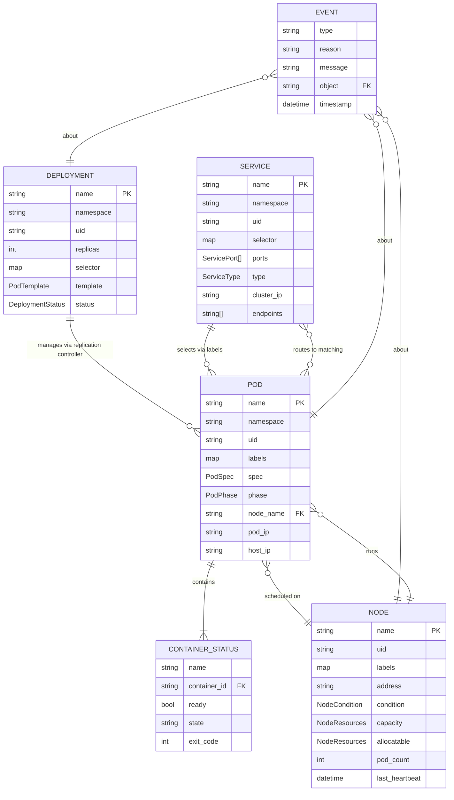

## Core Entities

### Pod

The smallest schedulable unit. Contains one or more container specifications.

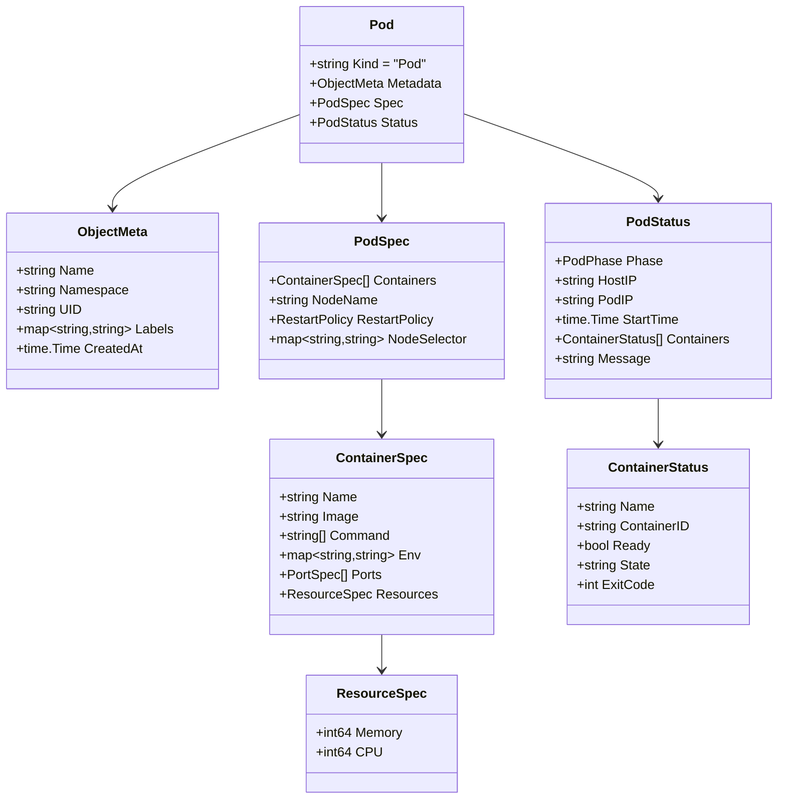

### Deployment

Manages a set of identical pod replicas.

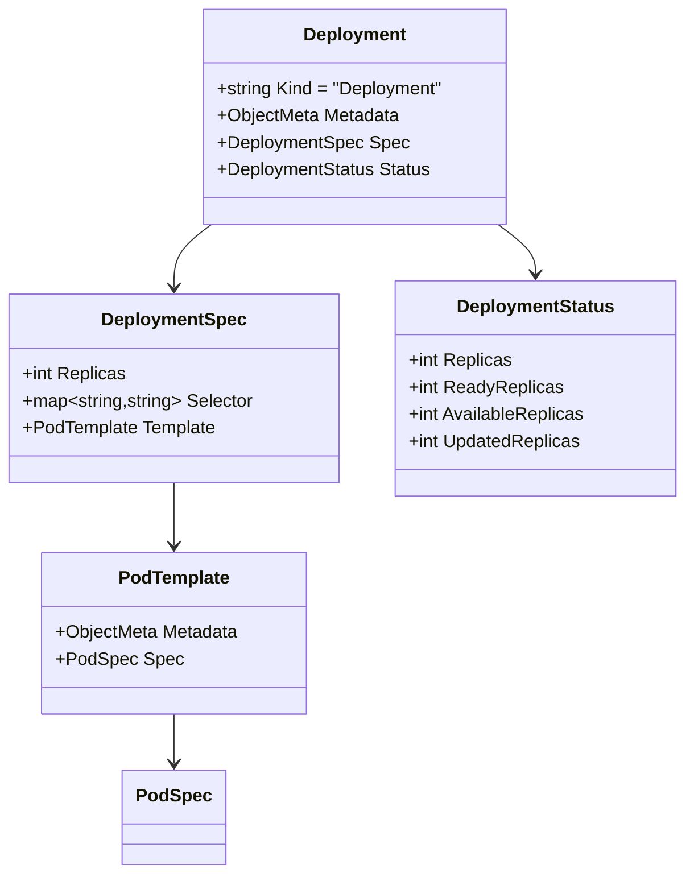

### Service

Routes traffic to a set of pods matched by label selector.

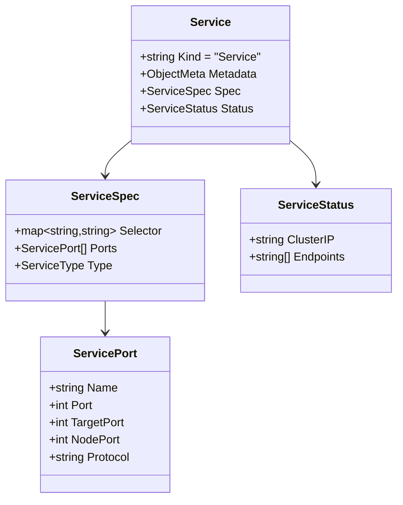

### Node

Represents a worker machine in the cluster.

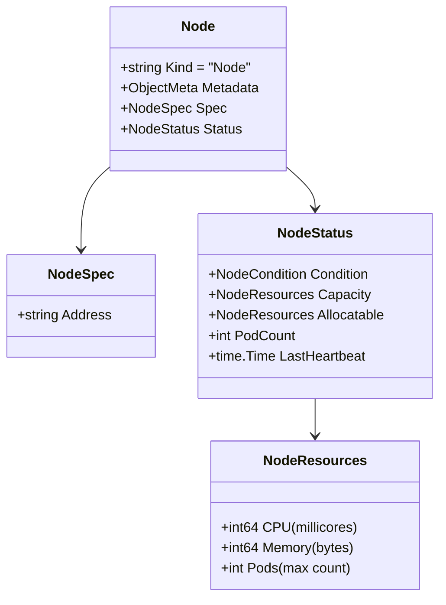

## BoltDB Storage Schema

BoltDB is an embedded key-value store organized into buckets (similar to tables).

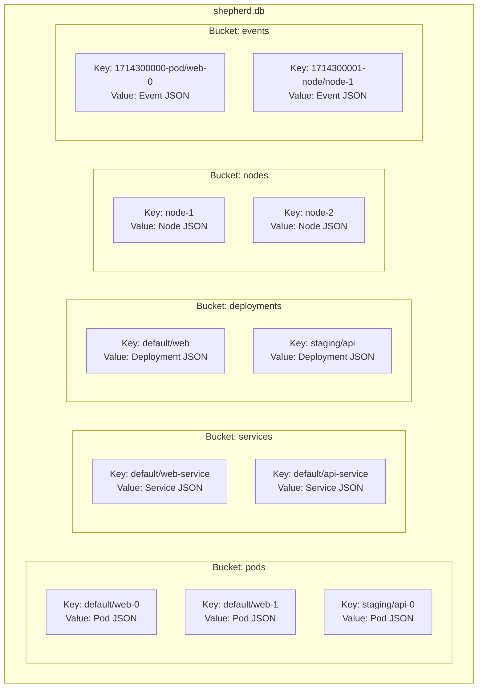

### Key Schema

| Bucket | Key Format | Example |
|--------|-----------|---------|
| `pods` | `{namespace}/{name}` | `default/web-0` |
| `services` | `{namespace}/{name}` | `default/web-service` |
| `deployments` | `{namespace}/{name}` | `default/web` |
| `nodes` | `{name}` | `node-1` |
| `events` | `{timestamp_ns}-{object}` | `1714300000-pod/web-0` |

### Storage Operations

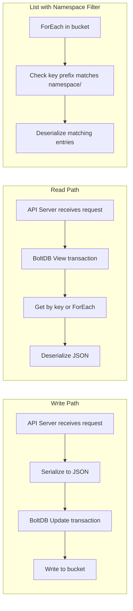

## Data Flow Diagrams

### Create Deployment Data Flow

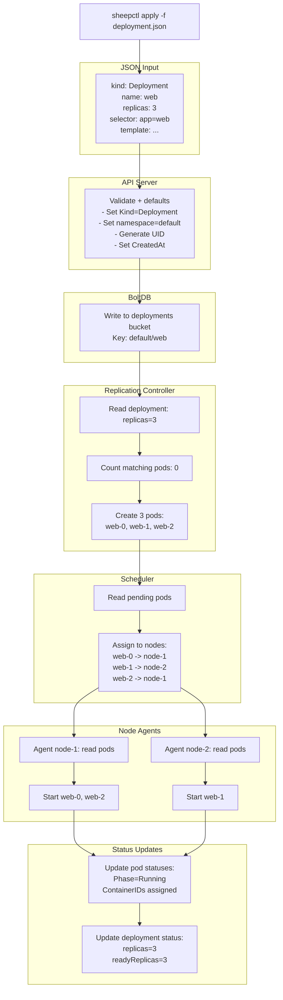

### Service Discovery Data Flow

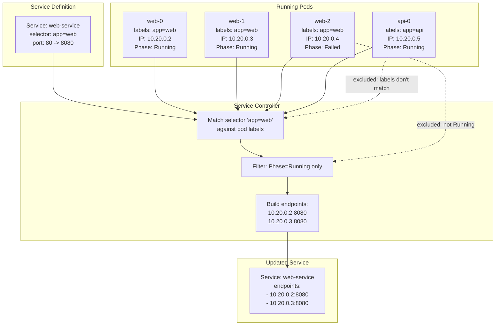

### Node Agent Heartbeat Data Flow

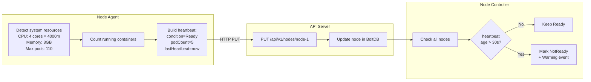

## State Machine Diagrams

### Pod Phase Transitions

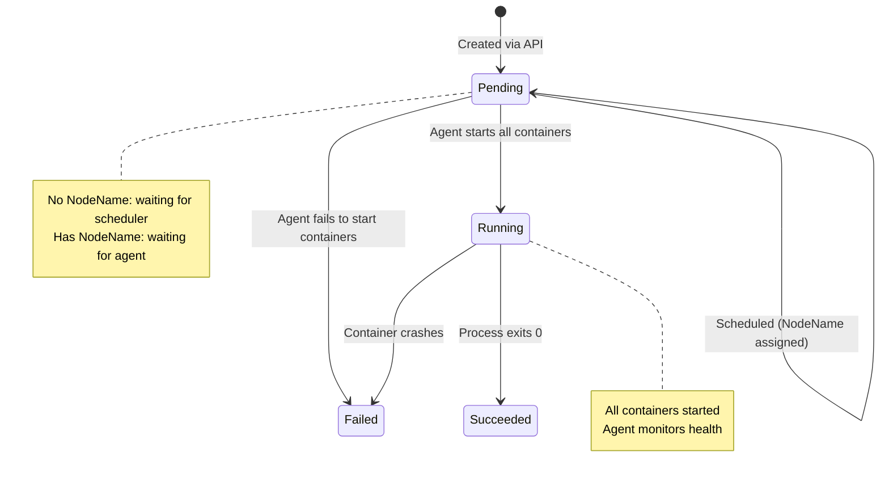

### Node Condition Transitions

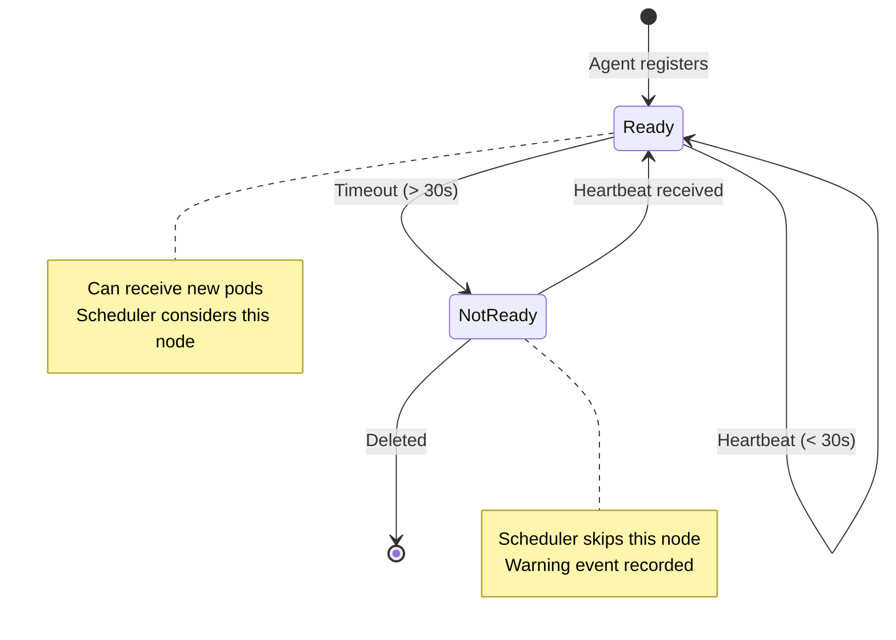

### Container State Transitions (Sheep Runtime)

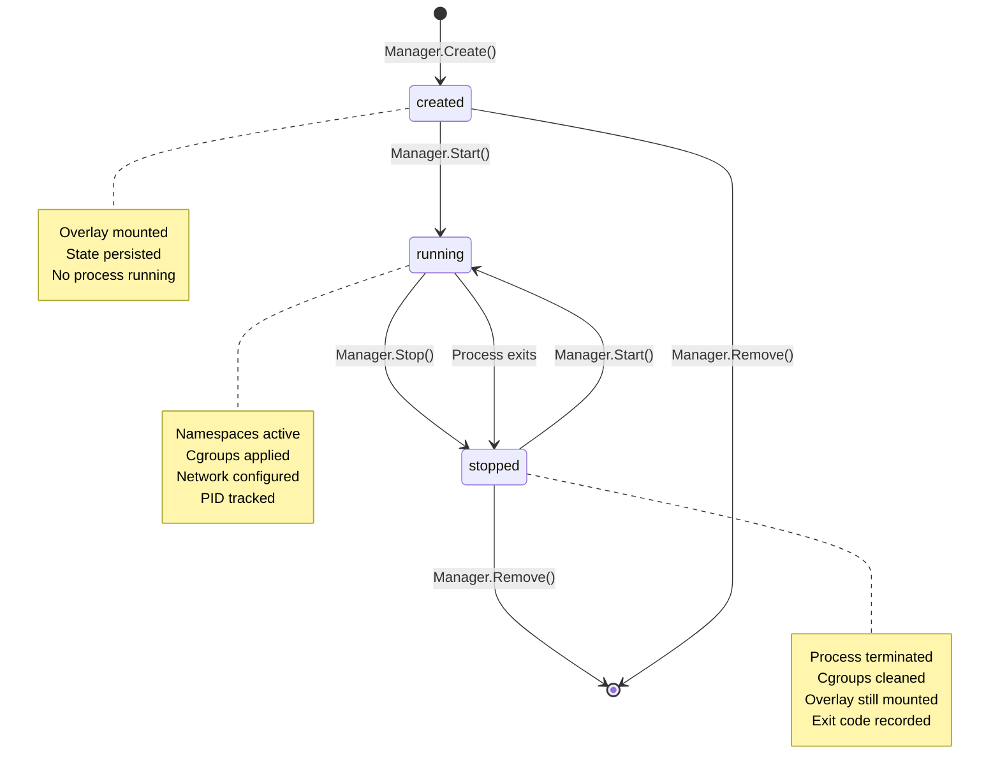

## Container State Schema

### state.json (per container)

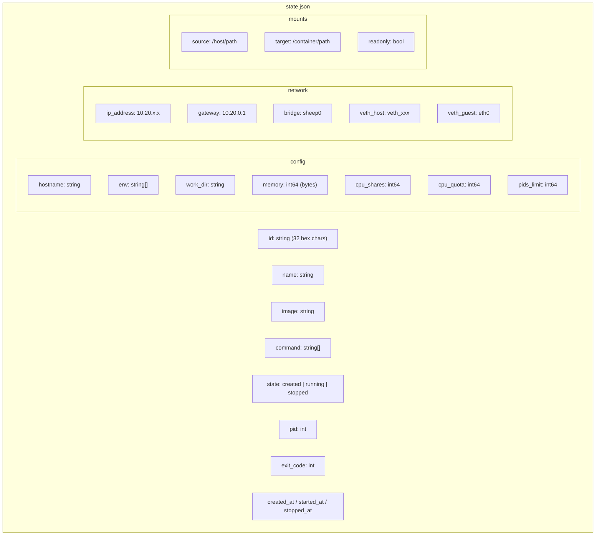

### manifest.json (per image)

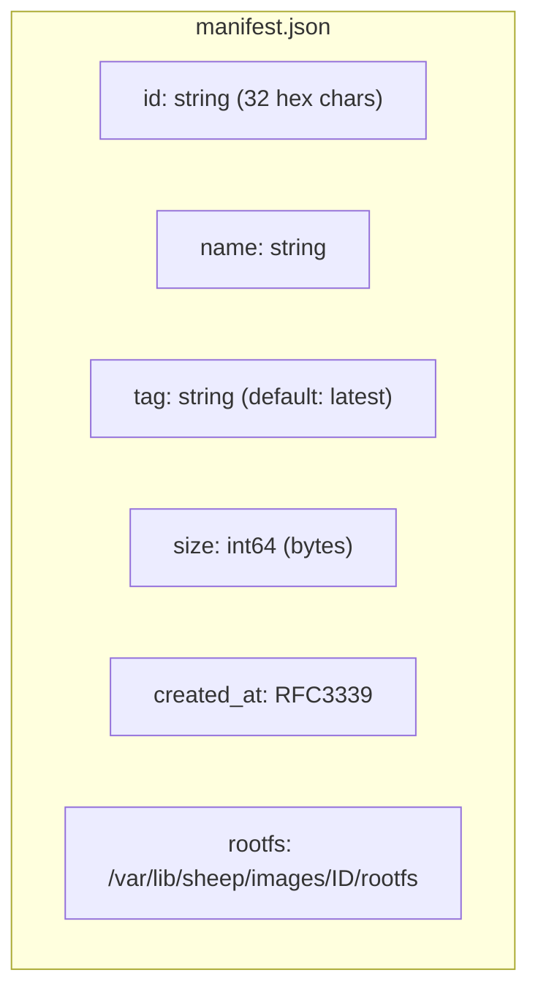
