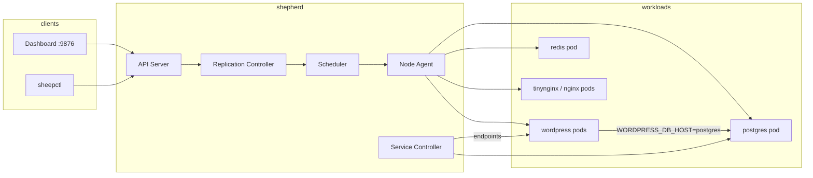

# Demo deployments — деплой існуючих контейнерів

Практичний посібник: як задеплоїти готові образи (WordPress, PostgreSQL, nginx тощо) у кластер Shepherd через `sheepctl apply`.

Маніфести та скрипти лежать у [`examples/demo/`](../examples/demo/).

## Зміст

- [Огляд](#огляд)
- [Передумови](#передумови)
- [macOS vs Linux](#macos-vs-linux)
- [Швидкий старт (macOS)](#швидкий-старт-macos)
- [Справжні OCI-образи (Linux)](#справжні-oci-образи-linux)
- [Архітектура demo-стеку](#архітектура-demo-стеку)
- [Як це працює](#як-це-працює)
- [Перевірка](#перевірка)
- [Видалення](#видалення)
- [Свій контейнер](#свій-контейнер)

---

## Огляд

Shepherd керує **Deployments**, **Pods** і **Services** — схоже на Kubernetes, але образ у маніфесті — це **ім'я локального образу Sheep**, а не команда `docker run`.

Типовий workflow:

1. Підготувати образ (`sheep pull`, `sheep import` або `sheep bootstrap`).
2. Запустити Shepherd (`standalone` для однонодового dev).
3. Застосувати JSON-маніфести: `sheepctl apply -f deployment.json`.
4. Перевірити через dashboard або `sheepctl get pods`.

У репозиторії є два набори прикладів:

| Набір | Шлях | Призначення |
|-------|------|-------------|
| **mac-demo** | `examples/demo/mac-demo/` | UI/demo на macOS (симуляції + справжній HTTP) |
| **linux-oci** | `examples/demo/linux-oci/` | Справжні образи з Docker Hub (Linux) |

---

## Передумови

```bash
make build
```

Запусти Shepherd у режимі `standalone` (API + node agent в одному процесі):

```bash
export SHEEP_DATA_DIR="$(pwd)/.run/sheep"   # dev на Mac
mkdir -p .run/shepherd .run/sheep

./bin/shepherd --mode standalone --addr :9876 --data-dir ./.run/shepherd
```

Змінні середовища:

| Змінна | Значення | Опис |
|--------|----------|------|
| `SHEPHERD_API` | `localhost:9876` | Адреса API для `sheepctl` |
| `SHEEP_DATA_DIR` | `.run/sheep` (Mac) / `/var/lib/sheep` (Linux) | Де зберігаються образи Sheep |

Dashboard (embedded SPA): http://localhost:9876/

---

## macOS vs Linux

| | **macOS** | **Linux** |
|---|-----------|-----------|
| Runtime | host mode (без cgroups v2) | повний ізоляційний runtime |
| Docker Hub | не напряму | `sheep pull image:tag` |
| Demo-стек | `scripts/demo-mac.sh` | `scripts/demo-linux-oci.sh` |
| WordPress/Postgres | симуляція на `minimal` | `wordpress:6-apache`, `postgres:16-alpine` |

На Mac WordPress і PostgreSQL — це **демонстраційні контейнери**: образ `minimal` з loop/sleep, щоб показати multi-tier layout у dashboard. Справжній HTTP дає **tinynginx** (локальний import).

---

## Швидкий старт (macOS)

```bash
export SHEPHERD_API=localhost:9876
export SHEEP_DATA_DIR="$(pwd)/.run/sheep"

./scripts/demo-mac.sh
```

Скрипт:

1. Bootstrap образу `minimal` (якщо ще немає).
2. Збирає та імпортує `tinynginx` з `examples/tinynginx/`.
3. Застосовує всі маніфести з `mac-demo/`.

Очікуваний результат:

| Deployment | Replicas | Service | Порт |
|------------|----------|---------|------|
| `postgres-db` | 1 | `postgres` | 5432 |
| `wordpress` | 2 | `wordpress` | 80 |
| `redis-cache` | 1 | `redis` | 6379 |
| `tinynginx` | 2 | `tinynginx` | 80→8888 |

```bash
./bin/sheepctl get pods
./bin/sheepctl get deployments
./bin/sheepctl get services
```

---

## Справжні OCI-образи (Linux)

На Linux можна підтягнути публічні образи з реєстру:

```bash
export SHEEP_DATA_DIR=/var/lib/sheep
export SHEPHERD_API=localhost:9876

./scripts/demo-linux-oci.sh
```

Скрипт виконує `sheep pull` для:

- `postgres:16-alpine`
- `wordpress:6-apache`
- `nginx:alpine`

і застосовує маніфести з `linux-oci/`.

WordPress підключається до БД через **ім'я Service** `postgres`:

```json
"env": {
  "WORDPRESS_DB_HOST": "postgres",
  "WORDPRESS_DB_NAME": "wordpress",
  "WORDPRESS_DB_USER": "wp",
  "WORDPRESS_DB_PASSWORD": "wp-secret-change-me"
}
```

PostgreSQL отримує відповідні `POSTGRES_*` змінні в `deployment-postgres.json`.

> **Безпека:** паролі в demo-маніфестах — лише для локального тесту. У production використовуй secrets (коли з'являться в платформі) або окремі env-файли.

---

## Архітектура demo-стеку



---

## Як це працює

### 1. Deployment → Pods

`Deployment` описує бажану кількість реплік і шаблон Pod. **Replication controller** створює/видаляє Pod-и, щоб `ready == replicas`.

Приклад (WordPress, 2 репліки на Mac):

```json
{
  "kind": "Deployment",
  "metadata": { "name": "wordpress" },
  "spec": {
    "replicas": 2,
    "selector": { "app": "wordpress" },
    "template": {
      "spec": {
        "containers": [{
          "name": "wordpress",
          "image": "minimal",
          "env": { "WORDPRESS_DB_HOST": "postgres" }
        }]
      }
    }
  }
}
```

### 2. Service → мережева адреса

`Service` збирає endpoints з Pod-ів за selector і дає стабільне ім'я (`postgres`, `wordpress`). Контейнери звертаються до сервісу за **DNS-ім'ям** (на Linux з кластерною мережею).

### 3. Образ у маніфесті

Поле `image` — це тег локального образу Sheep:

| Джерело | Команда |
|---------|---------|
| Мінімальний rootfs | `sheep bootstrap minimal` |
| Власний додаток | `sheep import myapp ./rootfs.tar.gz` |
| Публічний OCI (Linux) | `sheep pull nginx:alpine` |

Перевірка: `sheep images`.

### 4. Окремий apply

Можна застосовувати файли по одному — зручно для навчання:

```bash
sheepctl apply -f examples/demo/mac-demo/deployment-postgres.json
sheepctl apply -f examples/demo/mac-demo/service-postgres.json
sheepctl apply -f examples/demo/mac-demo/deployment-wordpress.json
sheepctl apply -f examples/demo/mac-demo/service-wordpress.json
```

---

## Перевірка

**CLI:**

```bash
sheepctl get pods
sheepctl get deployments
sheepctl get services
sheepctl get nodes
```

**Dashboard:** http://localhost:9876/

- **Pasture** — огляд кластера
- Сторінки Pod / Deployment / Service — деталі та статуси
- **Apply drawer** (Settings) — вставити JSON маніфест вручну

**API:**

```bash
curl -s http://localhost:9876/api/v1/cluster/summary | jq '.deployments[].metadata.name'
```

Pods спочатку можуть бути `Pending` кілька секунд — scheduler призначає їх на node, agent стартує контейнери.

---

## Видалення

```bash
sheepctl delete deployment postgres-db
sheepctl delete deployment wordpress
sheepctl delete deployment redis-cache
sheepctl delete deployment tinynginx

sheepctl delete service postgres
sheepctl delete service wordpress
sheepctl delete service redis
sheepctl delete service tinynginx
```

На Linux додай `nginx`, якщо застосовував `linux-oci/`.

---

## Свій контейнер

### Варіант A: import rootfs (Mac і Linux)

```bash
# Зібрати rootfs.tar.gz (bin/, etc/, dev/, proc/, sys/, tmp/)
sheep import myapp ./myapp-rootfs.tar.gz
```

У Deployment:

```json
"containers": [{
  "name": "app",
  "image": "myapp",
  "command": ["/bin/myapp", "--port", "8080"],
  "ports": [{ "container_port": 8080 }]
}]
```

### Варіант B: pull OCI (Linux)

```bash
sudo sheep pull redis:7-alpine
```

```json
"image": "redis:7-alpine"
```

### Варіант C: зібрати як tinynginx

Див. `scripts/demo-mac.sh` — `go build` бінарника в rootfs і `sheep import`.

---

## Див. також

- [`getting-started.md`](getting-started.md) — збірка, Sheep runtime, Shepherd
- [`dashboard.md`](dashboard.md) — API summary, embedded SPA
- [`examples/demo/README.md`](../examples/demo/README.md) — короткий довідник по файлах
