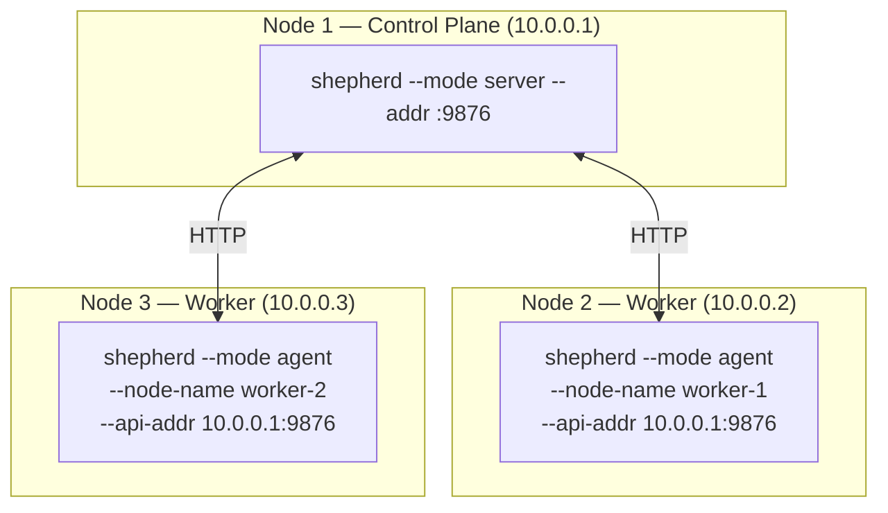

# Getting Started

Практичний гайд: збірка, створення образів, запуск контейнерів та оркестрація.

> **Вимога**: runtime працює тільки на Linux з cgroups v2. На macOS/Windows — тільки компіляція.

## Table of Contents

- [1. Збірка](#1-збірка)
- [2. Запуск контейнера (Sheep)](#2-запуск-контейнера-sheep)
- [3. Запуск свого застосунку](#3-запуск-свого-застосунку)
- [4. Оркестрація (Shepherd)](#4-оркестрація-shepherd)
- [5. Multi-Node кластер](#5-multi-node-кластер)

---

## 1. Збірка

```bash
# Збірка всіх трьох бінарників
make build

# Результат:
#   bin/sheep      — контейнерний рантайм
#   bin/shepherd   — оркестратор
#   bin/sheepctl   — CLI клієнт

# Крос-компіляція для Linux (з macOS):
GOOS=linux GOARCH=amd64 make build
```

## 2. Запуск контейнера (Sheep)

### Крок 1: Створити базовий образ

```bash
# Bootstrap — копіює базові утиліти з хост-системи
sudo ./bin/sheep bootstrap minimal

# Перевірити
sudo ./bin/sheep images
# IMAGE ID      NAME     TAG     SIZE      CREATED
# a1b2c3d4e5f6  minimal  latest  4.2 MB    2s ago
```

### Крок 2: Запустити контейнер

```bash
# Інтерактивний shell
sudo ./bin/sheep run --name mybox minimal /bin/sh

# З лімітами ресурсів
sudo ./bin/sheep run \
  --name limited \
  -m 128m \
  --pids-limit 50 \
  --cpu-quota 50000 \
  minimal /bin/sh

# У фоні (detach)
sudo ./bin/sheep run -d --name bg-task minimal /bin/sleep 3600
```

### Крок 3: Керування контейнерами

```bash
# Список запущених
sudo ./bin/sheep ps

# Список всіх (включно зі зупиненими)
sudo ./bin/sheep ps -a

# Детальна інформація
sudo ./bin/sheep inspect mybox

# Зупинити
sudo ./bin/sheep stop mybox

# Видалити
sudo ./bin/sheep rm mybox
```

## 3. Запуск свого застосунку

### Приклад: Go HTTP-сервер

**Крок 1**: Зібрати статичний бінарник

```bash
# Ваш застосунок (приклад)
cat > /tmp/myapp.go << 'EOF'
package main

import (
    "fmt"
    "net/http"
)

func main() {
    http.HandleFunc("/", func(w http.ResponseWriter, r *http.Request) {
        fmt.Fprintf(w, "Hello from Sheep container!\n")
    })
    fmt.Println("listening on :8080")
    http.ListenAndServe(":8080", nil)
}
EOF

# Статична збірка (важливо — без залежностей від libc)
CGO_ENABLED=0 GOOS=linux GOARCH=amd64 \
  go build -o /tmp/myapp /tmp/myapp.go
```

**Крок 2**: Створити образ з rootfs

```bash
# Створити структуру rootfs
mkdir -p /tmp/myapp-rootfs/{bin,etc,dev,proc,sys,tmp}

# Скопіювати бінарник
cp /tmp/myapp /tmp/myapp-rootfs/bin/myapp

# Мінімальні конфіги
echo "myapp-container" > /tmp/myapp-rootfs/etc/hostname
echo "127.0.0.1 localhost" > /tmp/myapp-rootfs/etc/hosts
echo "nameserver 8.8.8.8" > /tmp/myapp-rootfs/etc/resolv.conf

# Запакувати в tar
cd /tmp/myapp-rootfs && tar czf /tmp/myapp.tar.gz . && cd -

# Імпортувати в sheep
sudo ./bin/sheep import myapp /tmp/myapp.tar.gz
```

**Крок 3**: Запустити

```bash
sudo ./bin/sheep run \
  --name web \
  -d \
  -m 64m \
  --hostname web-server \
  myapp /bin/myapp

# Перевірити
sudo ./bin/sheep ps
sudo ./bin/sheep inspect web
# IP: 10.20.0.2

# Тест
curl http://10.20.0.2:8080/
# Hello from Sheep container!
```

### Приклад: Shell-скрипт

```bash
# Створити rootfs з shell-скриптом
mkdir -p /tmp/script-rootfs/{bin,etc,dev,proc,sys,tmp}

# Скопіювати потрібні утиліти
for bin in sh echo sleep cat ls mkdir; do
  cp /bin/$bin /tmp/script-rootfs/bin/ 2>/dev/null
done

# Створити скрипт
cat > /tmp/script-rootfs/bin/entrypoint.sh << 'SCRIPT'
#!/bin/sh
echo "Container started at $(cat /proc/uptime | cut -d' ' -f1)s"
echo "Hostname: $(cat /etc/hostname)"
echo "Running as PID $$"
while true; do
  echo "[$(cat /proc/uptime | cut -d' ' -f1)s] alive"
  sleep 10
done
SCRIPT
chmod +x /tmp/script-rootfs/bin/entrypoint.sh

# Мінімальні конфіги
echo "script-box" > /tmp/script-rootfs/etc/hostname
echo "127.0.0.1 localhost" > /tmp/script-rootfs/etc/hosts

# Імпорт і запуск
cd /tmp/script-rootfs && tar czf /tmp/script.tar.gz . && cd -
sudo ./bin/sheep import script-image /tmp/script.tar.gz
sudo ./bin/sheep run --name script-box script-image /bin/sh /bin/entrypoint.sh
```

## 4. Оркестрація (Shepherd)

### Standalone режим (все в одному процесі)

```bash
# Термінал 1: Запустити shepherd
sudo ./bin/shepherd --mode standalone --addr :9876

# Термінал 2: Працювати з кластером
export SHEPHERD_API=localhost:9876
```

### Розгорнути Pod

```bash
# Створити pod.json
cat > /tmp/pod.json << 'EOF'
{
  "kind": "Pod",
  "metadata": {
    "name": "web-server",
    "labels": {"app": "web"}
  },
  "spec": {
    "containers": [{
      "name": "web",
      "image": "myapp",
      "command": ["/bin/myapp"],
      "resources": {"memory": 67108864, "cpu": 250}
    }],
    "restart_policy": "Always"
  }
}
EOF

# Застосувати
./bin/sheepctl apply -f /tmp/pod.json

# Перевірити
./bin/sheepctl get pods
# NAME         STATUS    NODE       IP          AGE
# web-server   Running   my-host    10.20.0.2   5s
```

### Розгорнути Deployment (з реплікацією)

```bash
cat > /tmp/deployment.json << 'EOF'
{
  "kind": "Deployment",
  "metadata": {
    "name": "web",
    "labels": {"app": "web"}
  },
  "spec": {
    "replicas": 3,
    "selector": {"app": "web"},
    "template": {
      "metadata": {
        "labels": {"app": "web"}
      },
      "spec": {
        "containers": [{
          "name": "web",
          "image": "myapp",
          "command": ["/bin/myapp"],
          "resources": {"memory": 67108864, "cpu": 250}
        }],
        "restart_policy": "Always"
      }
    }
  }
}
EOF

./bin/sheepctl apply -f /tmp/deployment.json

# Shepherd автоматично створить 3 поди:
./bin/sheepctl get pods
# NAME    STATUS    NODE       IP           AGE
# web-0   Running   my-host    10.20.0.3    3s
# web-1   Running   my-host    10.20.0.4    3s
# web-2   Running   my-host    10.20.0.5    3s
```

### Створити Service

```bash
cat > /tmp/service.json << 'EOF'
{
  "kind": "Service",
  "metadata": {
    "name": "web-svc",
    "labels": {"app": "web"}
  },
  "spec": {
    "selector": {"app": "web"},
    "ports": [{"port": 80, "target_port": 8080}],
    "type": "ClusterIP"
  }
}
EOF

./bin/sheepctl apply -f /tmp/service.json

# Перевірити endpoints (знайде Running поди з label app=web)
./bin/sheepctl get services
# NAME      TYPE        CLUSTER-IP   PORTS        ENDPOINTS  AGE
# web-svc   ClusterIP                80->8080     3          2s
```

### Масштабування

```bash
# Збільшити до 5 реплік
./bin/sheepctl scale deployment/web --replicas=5

# Зменшити до 1
./bin/sheepctl scale deployment/web --replicas=1

# Моніторинг
./bin/sheepctl get deployments
# NAME   READY   AVAILABLE   AGE
# web    1/1     1           2m
```

### Моніторинг кластера

```bash
# Ноди
./bin/sheepctl nodes
# NAME       STATUS   PODS   CPU      MEMORY    AGE
# my-host    Ready    3      4000m    8.0 GB    5m

# Події
./bin/sheepctl events
# TYPE      REASON      OBJECT          MESSAGE                              AGE
# Normal    Created     pod/web-0       Pod web-0 created                    5m
# Normal    Scheduled   pod/web-0       Pod web-0 scheduled to my-host       5m
# Normal    Created     deployment/web  Created pod web-0 for deployment     5m

# Інформація про кластер
./bin/sheepctl info
# Shepherd Cluster Info
# ---------------------
# version:        v0.1.0
# name:           shepherd
# node_count:     1
# pod_count:      3

# Детальна інформація про pod
./bin/sheepctl describe pod web-0
```

### Очистка

```bash
./bin/sheepctl delete deployment web
./bin/sheepctl delete service web-svc
./bin/sheepctl delete pod web-server
```

## 5. Multi-Node кластер



```bash
# Node 1 (control plane):
sudo ./bin/shepherd --mode server --addr :9876

# Node 2 (worker):
sudo ./bin/shepherd --mode agent \
  --node-name worker-1 \
  --api-addr 10.0.0.1:9876

# Node 3 (worker):
sudo ./bin/shepherd --mode agent \
  --node-name worker-2 \
  --api-addr 10.0.0.1:9876

# З будь-якої машини:
export SHEPHERD_API=10.0.0.1:9876
./bin/sheepctl nodes
# NAME       STATUS   PODS   CPU      MEMORY    AGE
# worker-1   Ready    0      4000m    8.0 GB    10s
# worker-2   Ready    0      8000m    16.0 GB   8s

# Scheduler розподілить поди по нодах автоматично
./bin/sheepctl apply -f deployment.json
./bin/sheepctl get pods
# NAME    STATUS    NODE        IP           AGE
# web-0   Running   worker-1    10.20.0.2    3s
# web-1   Running   worker-2    10.20.0.3    3s
# web-2   Running   worker-1    10.20.0.4    3s
```

## Повна шпаргалка

### Sheep — контейнери

```bash
# --- Образи ---
sheep pull nginx:alpine                       # тягнути з Docker Hub
sheep pull localhost:5555/myapp:v1            # тягнути з Meadow
sheep push localhost:5555/myteam/app:v2       # запушити у Meadow
sheep tag nginx:alpine myregistry/nginx:prod  # перетегувати образ
sheep images                                  # список образів
sheep import myapp rootfs.tar.gz              # імпорт з тарболу
sheep bootstrap minimal                       # мінімальний образ з хоста
sheep rmi <image>                             # видалити образ

# --- Контейнери ---
sheep run -d --name web nginx /usr/sbin/nginx   # запустити у фоні
sheep run --name box -m 256m alpine /bin/sh     # з лімітом пам'яті
sheep run -d --name api \
  -m 512m --pids-limit 100 \
  -e PORT=3000 -e ENV=prod \
  -v /data:/app/data:ro \
  myapp /bin/server                              # повний приклад

sheep create --name later alpine /bin/sh         # створити без старту
sheep start later                                # запустити пізніше

sheep ps                                         # тільки запущені
sheep ps -a                                      # всі контейнери
sheep inspect web                                # деталі (PID, IP, ліміти)
sheep logs web                                   # stdout/stderr
sheep stop web                                   # зупинити (SIGTERM→SIGKILL)
sheep rm web                                     # видалити
sheep rm web api box                             # видалити кілька
```

### Meadow — реєстр образів

```bash
meadow --addr :5555                              # запустити реєстр

curl http://localhost:5555/v2/                    # health check
curl http://localhost:5555/v2/_catalog            # список репо
curl http://localhost:5555/v2/myapp/tags/list     # теги
curl http://localhost:5555/meadow/stats           # статистика
```

### Shepherd — оркестрація

```bash
# --- Запуск ---
shepherd --mode standalone                        # все-в-одному (dev)
shepherd --mode server --addr :9876               # control plane
shepherd --mode agent \
  --node-name worker-1 \
  --api-addr 10.0.0.1:9876                       # worker node

# --- Керування ресурсами ---
sheepctl apply -f pod.json                        # створити з файлу
sheepctl apply -f deployment.json
sheepctl apply -f service.json

sheepctl get pods                                 # список подів
sheepctl get pods -n staging                      # в конкретному namespace
sheepctl get pod my-pod                           # конкретний под
sheepctl get services                             # список сервісів
sheepctl get deployments                          # список деплойментів

sheepctl describe pod my-pod                      # детальний JSON
sheepctl describe deployment web

sheepctl scale deployment/web --replicas=5        # масштабувати
sheepctl scale deployment/web --replicas=1        # зменшити

sheepctl delete pod my-pod                        # видалити під
sheepctl delete deployment web                    # видалити деплоймент
sheepctl delete service web-svc                   # видалити сервіс

# --- Моніторинг ---
sheepctl nodes                                    # стан нод
sheepctl events                                   # події кластера
sheepctl info                                     # зведена інформація
sheepctl logs my-pod                              # логи поду
```

### Змінні оточення

```bash
export SHEEP_DATA_DIR=/tmp/sheep     # каталог даних sheep (default: /var/lib/sheep)
export SHEPHERD_API=10.0.0.1:9876    # адреса API shepherd (default: localhost:9876)
```
