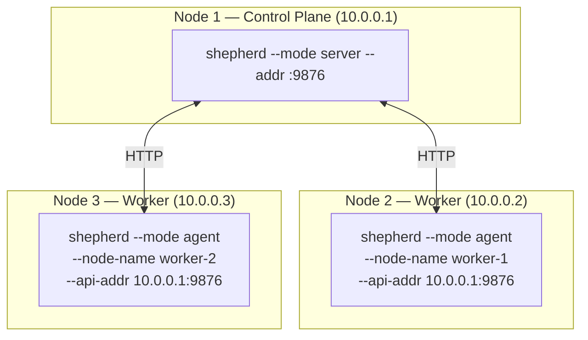

# Getting Started

A practical guide: building, creating images, running containers, and orchestration.

> **Requirement**: the runtime only works on Linux with cgroups v2. On macOS/Windows — compilation only.

## Table of Contents

- [1. Building](#1-building)
- [2. Running a Container (Sheep)](#2-running-a-container-sheep)
- [3. Running Your Own Application](#3-running-your-own-application)
- [4. Orchestration (Shepherd)](#4-orchestration-shepherd)
- [5. Multi-Node Cluster](#5-multi-node-cluster)

---

## 1. Building

```bash
# Build all three binaries
make build

# Output:
#   bin/sheep      — container runtime
#   bin/shepherd   — orchestrator
#   bin/sheepctl   — CLI client

# Cross-compile for Linux (from macOS):
GOOS=linux GOARCH=amd64 make build
```

## 2. Running a Container (Sheep)

### Step 1: Create a base image

```bash
# Bootstrap — copies basic utilities from the host system
sudo ./bin/sheep bootstrap minimal

# Verify
sudo ./bin/sheep images
# IMAGE ID      NAME     TAG     SIZE      CREATED
# a1b2c3d4e5f6  minimal  latest  4.2 MB    2s ago
```

### Step 2: Run a container

```bash
# Interactive shell
sudo ./bin/sheep run --name mybox minimal /bin/sh

# With resource limits
sudo ./bin/sheep run \
  --name limited \
  -m 128m \
  --pids-limit 50 \
  --cpu-quota 50000 \
  minimal /bin/sh

# In the background (detach)
sudo ./bin/sheep run -d --name bg-task minimal /bin/sleep 3600
```

### Step 3: Manage containers

```bash
# List running containers
sudo ./bin/sheep ps

# List all (including stopped)
sudo ./bin/sheep ps -a

# Detailed information
sudo ./bin/sheep inspect mybox

# Stop
sudo ./bin/sheep stop mybox

# Remove
sudo ./bin/sheep rm mybox
```

## 3. Running Your Own Application

### Example: Go HTTP server

**Step 1**: Build a static binary

```bash
# Your application (example)
cat > /tmp/myapp.go << 'EOF'
package main

import (
    "fmt"
    "net/http"
)

func main() {
    http.HandleFunc("/", func(w http.ResponseWriter, r *http.Request) {
        fmt.Fprintf(w, "Hello from Sheep container!\n")
    })
    fmt.Println("listening on :8080")
    http.ListenAndServe(":8080", nil)
}
EOF

# Static build (important — no libc dependencies)
CGO_ENABLED=0 GOOS=linux GOARCH=amd64 \
  go build -o /tmp/myapp /tmp/myapp.go
```

**Step 2**: Create an image from a rootfs

```bash
# Create the rootfs structure
mkdir -p /tmp/myapp-rootfs/{bin,etc,dev,proc,sys,tmp}

# Copy the binary
cp /tmp/myapp /tmp/myapp-rootfs/bin/myapp

# Minimal configs
echo "myapp-container" > /tmp/myapp-rootfs/etc/hostname
echo "127.0.0.1 localhost" > /tmp/myapp-rootfs/etc/hosts
echo "nameserver 8.8.8.8" > /tmp/myapp-rootfs/etc/resolv.conf

# Pack into a tar
cd /tmp/myapp-rootfs && tar czf /tmp/myapp.tar.gz . && cd -

# Import into sheep
sudo ./bin/sheep import myapp /tmp/myapp.tar.gz
```

**Step 3**: Run

```bash
sudo ./bin/sheep run \
  --name web \
  -d \
  -m 64m \
  --hostname web-server \
  myapp /bin/myapp

# Verify
sudo ./bin/sheep ps
sudo ./bin/sheep inspect web
# IP: 10.20.0.2

# Test
curl http://10.20.0.2:8080/
# Hello from Sheep container!
```

### Example: Shell script

```bash
# Create a rootfs with a shell script
mkdir -p /tmp/script-rootfs/{bin,etc,dev,proc,sys,tmp}

# Copy the required utilities
for bin in sh echo sleep cat ls mkdir; do
  cp /bin/$bin /tmp/script-rootfs/bin/ 2>/dev/null
done

# Create the script
cat > /tmp/script-rootfs/bin/entrypoint.sh << 'SCRIPT'
#!/bin/sh
echo "Container started at $(cat /proc/uptime | cut -d' ' -f1)s"
echo "Hostname: $(cat /etc/hostname)"
echo "Running as PID $$"
while true; do
  echo "[$(cat /proc/uptime | cut -d' ' -f1)s] alive"
  sleep 10
done
SCRIPT
chmod +x /tmp/script-rootfs/bin/entrypoint.sh

# Minimal configs
echo "script-box" > /tmp/script-rootfs/etc/hostname
echo "127.0.0.1 localhost" > /tmp/script-rootfs/etc/hosts

# Import and run
cd /tmp/script-rootfs && tar czf /tmp/script.tar.gz . && cd -
sudo ./bin/sheep import script-image /tmp/script.tar.gz
sudo ./bin/sheep run --name script-box script-image /bin/sh /bin/entrypoint.sh
```

## 4. Orchestration (Shepherd)

### Standalone mode (everything in one process)

```bash
# Terminal 1: Start shepherd
sudo ./bin/shepherd --mode standalone --addr :9876

# Terminal 2: Work with the cluster
export SHEPHERD_API=localhost:9876
```

### Deploy a Pod

```bash
# Create pod.json
cat > /tmp/pod.json << 'EOF'
{
  "kind": "Pod",
  "metadata": {
    "name": "web-server",
    "labels": {"app": "web"}
  },
  "spec": {
    "containers": [{
      "name": "web",
      "image": "myapp",
      "command": ["/bin/myapp"],
      "resources": {"memory": 67108864, "cpu": 250}
    }],
    "restart_policy": "Always"
  }
}
EOF

# Apply
./bin/sheepctl apply -f /tmp/pod.json

# Verify
./bin/sheepctl get pods
# NAME         STATUS    NODE       IP          AGE
# web-server   Running   my-host    10.20.0.2   5s
```

### Deploy a Deployment (with replication)

```bash
cat > /tmp/deployment.json << 'EOF'
{
  "kind": "Deployment",
  "metadata": {
    "name": "web",
    "labels": {"app": "web"}
  },
  "spec": {
    "replicas": 3,
    "selector": {"app": "web"},
    "template": {
      "metadata": {
        "labels": {"app": "web"}
      },
      "spec": {
        "containers": [{
          "name": "web",
          "image": "myapp",
          "command": ["/bin/myapp"],
          "resources": {"memory": 67108864, "cpu": 250}
        }],
        "restart_policy": "Always"
      }
    }
  }
}
EOF

./bin/sheepctl apply -f /tmp/deployment.json

# Shepherd will automatically create 3 pods:
./bin/sheepctl get pods
# NAME    STATUS    NODE       IP           AGE
# web-0   Running   my-host    10.20.0.3    3s
# web-1   Running   my-host    10.20.0.4    3s
# web-2   Running   my-host    10.20.0.5    3s
```

### Create a Service

```bash
cat > /tmp/service.json << 'EOF'
{
  "kind": "Service",
  "metadata": {
    "name": "web-svc",
    "labels": {"app": "web"}
  },
  "spec": {
    "selector": {"app": "web"},
    "ports": [{"port": 80, "target_port": 8080}],
    "type": "ClusterIP"
  }
}
EOF

./bin/sheepctl apply -f /tmp/service.json

# Check endpoints (finds Running pods with label app=web)
./bin/sheepctl get services
# NAME      TYPE        CLUSTER-IP   PORTS        ENDPOINTS  AGE
# web-svc   ClusterIP                80->8080     3          2s
```

### Scaling

```bash
# Scale up to 5 replicas
./bin/sheepctl scale deployment/web --replicas=5

# Scale down to 1
./bin/sheepctl scale deployment/web --replicas=1

# Monitoring
./bin/sheepctl get deployments
# NAME   READY   AVAILABLE   AGE
# web    1/1     1           2m
```

### Cluster monitoring

```bash
# Nodes
./bin/sheepctl nodes
# NAME       STATUS   PODS   CPU      MEMORY    AGE
# my-host    Ready    3      4000m    8.0 GB    5m

# Events
./bin/sheepctl events
# TYPE      REASON      OBJECT          MESSAGE                              AGE
# Normal    Created     pod/web-0       Pod web-0 created                    5m
# Normal    Scheduled   pod/web-0       Pod web-0 scheduled to my-host       5m
# Normal    Created     deployment/web  Created pod web-0 for deployment     5m

# Cluster information
./bin/sheepctl info
# Shepherd Cluster Info
# ---------------------
# version:        v0.1.0
# name:           shepherd
# node_count:     1
# pod_count:      3

# Detailed pod information
./bin/sheepctl describe pod web-0
```

### Cleanup

```bash
./bin/sheepctl delete deployment web
./bin/sheepctl delete service web-svc
./bin/sheepctl delete pod web-server
```

## 5. Multi-Node Cluster



```bash
# Node 1 (control plane):
sudo ./bin/shepherd --mode server --addr :9876

# Node 2 (worker):
sudo ./bin/shepherd --mode agent \
  --node-name worker-1 \
  --api-addr 10.0.0.1:9876

# Node 3 (worker):
sudo ./bin/shepherd --mode agent \
  --node-name worker-2 \
  --api-addr 10.0.0.1:9876

# From any machine:
export SHEPHERD_API=10.0.0.1:9876
./bin/sheepctl nodes
# NAME       STATUS   PODS   CPU      MEMORY    AGE
# worker-1   Ready    0      4000m    8.0 GB    10s
# worker-2   Ready    0      8000m    16.0 GB   8s

# The scheduler will distribute pods across nodes automatically
./bin/sheepctl apply -f deployment.json
./bin/sheepctl get pods
# NAME    STATUS    NODE        IP           AGE
# web-0   Running   worker-1    10.20.0.2    3s
# web-1   Running   worker-2    10.20.0.3    3s
# web-2   Running   worker-1    10.20.0.4    3s
```

## Full Cheat Sheet

### Sheep — containers

```bash
# --- Images ---
sheep pull nginx:alpine                       # pull from Docker Hub
sheep pull localhost:5555/myapp:v1            # pull from Meadow
sheep push localhost:5555/myteam/app:v2       # push to Meadow
sheep tag nginx:alpine myregistry/nginx:prod  # retag an image
sheep images                                  # list images
sheep import myapp rootfs.tar.gz              # import from a tarball
sheep bootstrap minimal                       # minimal image from the host
sheep rmi <image>                             # remove an image

# --- Containers ---
sheep run -d --name web nginx /usr/sbin/nginx   # run in the background
sheep run --name box -m 256m alpine /bin/sh     # with a memory limit
sheep run -d --name api \
  -m 512m --pids-limit 100 \
  -e PORT=3000 -e ENV=prod \
  -v /data:/app/data:ro \
  myapp /bin/server                              # full example

sheep create --name later alpine /bin/sh         # create without starting
sheep start later                                # start later

sheep ps                                         # running only
sheep ps -a                                      # all containers
sheep inspect web                                # details (PID, IP, limits)
sheep logs web                                   # stdout/stderr
sheep stop web                                   # stop (SIGTERM→SIGKILL)
sheep rm web                                     # remove
sheep rm web api box                             # remove several
```

### Meadow — image registry

See **[Meadow Workflow](meadow-workflow.md)** for a full build → push → deploy guide.

```bash
meadow --addr :5555                              # start the registry

curl http://localhost:5555/v2/                    # health check
curl http://localhost:5555/v2/_catalog            # list repos
curl http://localhost:5555/v2/myapp/tags/list     # tags
curl http://localhost:5555/meadow/stats           # statistics
```

### Shepherd — orchestration

```bash
# --- Startup ---
shepherd --mode standalone                        # all-in-one (dev)
shepherd --mode server --addr :9876               # control plane
shepherd --mode agent \
  --node-name worker-1 \
  --api-addr 10.0.0.1:9876                       # worker node

# --- Resource management ---
sheepctl apply -f pod.json                        # create from a file
sheepctl apply -f deployment.json
sheepctl apply -f service.json

sheepctl get pods                                 # list pods
sheepctl get pods -n staging                      # in a specific namespace
sheepctl get pod my-pod                           # a specific pod
sheepctl get services                             # list services
sheepctl get deployments                          # list deployments

sheepctl describe pod my-pod                      # detailed JSON
sheepctl describe deployment web

sheepctl scale deployment/web --replicas=5        # scale up
sheepctl scale deployment/web --replicas=1        # scale down

sheepctl delete pod my-pod                        # delete a pod
sheepctl delete deployment web                    # delete a deployment
sheepctl delete service web-svc                   # delete a service

# --- Monitoring ---
sheepctl nodes                                    # node status
sheepctl events                                   # cluster events
sheepctl info                                     # cluster summary
sheepctl logs my-pod                              # pod logs
```

### Environment variables

```bash
export SHEEP_DATA_DIR=/tmp/sheep     # sheep data directory (default: /var/lib/sheep)
export SHEPHERD_API=10.0.0.1:9876    # shepherd API address (default: localhost:9876)
```
