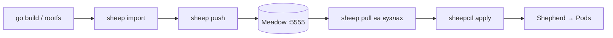

# Meadow workflow — збірка образу, push у registry, deploy

Покроковий посібник: як зібрати образ для Sheep, опублікувати його в **Meadow** (OCI registry) і задеплоїти через **Shepherd**.

## Зміст

- [Огляд](#огляд)
- [Передумови](#передумови)
- [1. Запуск Meadow](#1-запуск-meadow)
- [2. Збірка локального образу](#2-збірка-локального-образу)
- [3. Push у Meadow](#3-push-у-meadow)
- [4. Pull на вузлах кластера](#4-pull-на-вузлах-кластера)
- [5. Deploy через Shepherd](#5-deploy-через-shepherd)
- [6. Перевірка](#6-перевірка)
- [macOS vs Linux](#macos-vs-linux)
- [Auth (опційно)](#auth-опційно)
- [Швидкий приклад (tinynginx)](#швидкий-приклад-tinynginx)
- [Див. також](#див-також)

---

## Огляд



| Крок | Команда | Де працює |
|------|---------|-----------|
| Зібрати rootfs | `sheep import` | Mac, Linux |
| Опублікувати | `sheep push localhost:5555/...` | Mac, Linux |
| Завантажити на вузол | `sheep pull localhost:5555/...` | Mac, Linux |
| Запустити в кластері | `sheepctl apply` | Linux (повний runtime); Mac — обмежено |

Meadow реалізує **OCI Distribution Spec** (`/v2/`). Sheep вміє push/pull без Docker daemon.

---

## Передумови

```bash
make build
# bin/sheep, bin/meadow, bin/shepherd, bin/sheepctl
```

Змінні для dev:

```bash
export SHEEP_DATA_DIR="$(pwd)/.run/sheep"
export SHEPHERD_API=localhost:9876
mkdir -p .run/sheep .run/meadow .run/shepherd
```

---

## 1. Запуск Meadow

```bash
./bin/meadow --addr :5555 --data-dir ./.run/meadow
```

Перевірка:

```bash
curl -s http://localhost:5555/v2/
# {}

curl -s http://localhost:5555/v2/_catalog
# {"repositories":[]}
```

Dashboard (Meadow UI): http://localhost:9876/meadow або http://localhost:5173/meadow (Vite dev).

---

## 2. Збірка локального образу

Образ у Sheep — це **rootfs** (tar.gz), не Dockerfile. Типовий шлях для власного додатку:

### Крок 2a: статичний бінарник

```bash
CGO_ENABLED=0 GOOS=linux GOARCH=amd64 \
  go build -o /tmp/myapp ./path/to/main.go
```

> `CGO_ENABLED=0` — бінарник без залежності від glibc у контейнері.

### Крок 2b: rootfs

```bash
mkdir -p /tmp/myapp-rootfs/{bin,etc,dev,proc,sys,tmp}

cp /tmp/myapp /tmp/myapp-rootfs/bin/myapp
echo "myapp" > /tmp/myapp-rootfs/etc/hostname
echo "127.0.0.1 localhost" > /tmp/myapp-rootfs/etc/hosts

cd /tmp/myapp-rootfs && tar czf /tmp/myapp.tar.gz . && cd -
```

Обов'язкові каталоги в rootfs: `bin`, `etc`, `dev`, `proc`, `sys`, `tmp` — runtime очікує мінімальну FHS-структуру.

### Крок 2c: import

```bash
export SHEEP_DATA_DIR="$(pwd)/.run/sheep"
./bin/sheep import myapp /tmp/myapp.tar.gz
./bin/sheep images
```

Ім'я `myapp` — локальний тег образу (як `name:latest`).

**Альтернативи:**

| Метод | Команда | Коли |
|-------|---------|------|
| Bootstrap | `sheep bootstrap minimal` | мінімальний shell-образ з хоста |
| Pull Docker Hub | `sheep pull nginx:alpine` | Linux, публічні образи |
| Retag | `sheep tag myapp:latest team/myapp:v1` | перед push під іншим ім'ям |

---

## 3. Push у Meadow

Синтаксис: `sheep push <registry>/<repo>:<tag>`

```bash
# Якщо образ імпортовано як "myapp" (latest):
./bin/sheep tag myapp:latest myteam/myapp:v1

./bin/sheep push localhost:5555/myteam/myapp:v1
```

Очікуваний вивід:

```
pushing to localhost:5555/myteam/myapp:v1
creating layer from rootfs...
uploading layer sha256:...
uploading config...
uploading manifest...
push complete
```

Перевірка в registry:

```bash
curl -s http://localhost:5555/v2/_catalog
curl -s http://localhost:5555/v2/myteam/myapp/tags/list
# {"name":"myteam/myapp","tags":["v1"]}
```

У Meadow UI відкрий репозиторій — там буде pull-команда та список тегів.

---

## 4. Pull на вузлах кластера

На кожному вузлі, де agent запускає контейнери:

```bash
export SHEEP_DATA_DIR=/var/lib/sheep   # prod
# або SHEEP_DATA_DIR="$(pwd)/.run/sheep" для dev

./bin/sheep pull localhost:5555/myteam/myapp:v1
./bin/sheep images
```

Після pull локальне ім'я образу — `myteam/myapp:v1` (repo + tag).

---

## 5. Deploy через Shepherd

Запусти control plane (якщо ще не запущено):

```bash
export SHEEP_DATA_DIR="$(pwd)/.run/sheep"
./bin/shepherd --mode standalone --addr :9876 --data-dir ./.run/shepherd
```

Маніфест deployment:

```json
{
  "kind": "Deployment",
  "metadata": {
    "name": "myapp",
    "namespace": "default",
    "labels": { "app": "myapp" }
  },
  "spec": {
    "replicas": 2,
    "selector": { "app": "myapp" },
    "template": {
      "metadata": { "labels": { "app": "myapp" } },
      "spec": {
        "containers": [
          {
            "name": "app",
            "image": "myteam/myapp:v1",
            "command": ["/bin/myapp"],
            "ports": [{ "container_port": 8080 }],
            "resources": { "memory": 67108864, "cpu": 100 }
          }
        ],
        "restart_policy": "Always"
      }
    }
  }
}
```

Застосувати:

```bash
export SHEPHERD_API=localhost:9876
./bin/sheepctl apply -f deployment.json

# Опційно — Service для доступу всередині кластера
./bin/sheepctl apply -f service.json
```

Поле `"image"` має **точно збігатися** з локальним тегом після `sheep pull` / `sheep import`.

Replication controller створить pod-и; agent на вузлі стартує контейнери. Видалення deployment каскадно прибирає pod-и.

---

## 6. Перевірка

**CLI:**

```bash
./bin/sheepctl get deployments
./bin/sheepctl get pods
./bin/sheepctl get services
```

**Dashboard:** http://localhost:9876/

**Meadow stats:**

```bash
curl -s http://localhost:5555/meadow/stats | jq .
```

---

## macOS vs Linux

| Дія | macOS | Linux |
|-----|-------|-------|
| `sheep import` | ✅ | ✅ |
| `sheep push` → Meadow | ✅ | ✅ |
| `sheep pull` ← Meadow | ✅ | ✅ |
| Запуск pod у кластері | host mode, обмеження | ✅ cgroups, overlay, мережа |

На Mac зручно **збирати і пушити** образи в Meadow; для **production run** потрібен Linux worker з `sheep pull` перед deploy.

---

## Auth (опційно)

Якщо задано `MEADOW_API_TOKEN`, push/pull потребують Bearer token (Sheep CLI використовує env або конфіг реєстру).

```bash
export MEADOW_API_TOKEN=your-secret
./bin/meadow --addr :5555 --data-dir ./.run/meadow
```

У dashboard: **Settings** → Meadow API URL + token.

Endpoints без auth: `GET /meadow/auth/status`, `GET /v2/` (health).

Деталі: [`docs/adr/ADR-0003-api-token-auth.md`](adr/ADR-0003-api-token-auth.md).

---

## Швидкий приклад (tinynginx)

З репозиторію — зібрати demo-образ і запушити в Meadow:

```bash
export SHEEP_DATA_DIR="$(pwd)/.run/sheep"
mkdir -p "$SHEEP_DATA_DIR"

# Збірка (фрагмент з scripts/demo-mac.sh)
TMP="$(mktemp -d)"
mkdir -p "$TMP/rootfs"/{bin,etc,dev,proc,sys,tmp}
CGO_ENABLED=0 go build -o "$TMP/rootfs/bin/tinynginx" ./examples/tinynginx/main.go
echo "tinynginx" > "$TMP/rootfs/etc/hostname"
echo "127.0.0.1 localhost" > "$TMP/rootfs/etc/hosts"
( cd "$TMP/rootfs" && tar czf "$TMP/tinynginx.tar.gz" . )
./bin/sheep import tinynginx "$TMP/tinynginx.tar.gz"
rm -rf "$TMP"

# Push
./bin/sheep tag tinynginx:latest demo/tinynginx:v1
./bin/sheep push localhost:5555/demo/tinynginx:v1

# Pull + deploy (на Linux-вузлі або dev)
./bin/sheep pull localhost:5555/demo/tinynginx:v1
./bin/sheepctl apply -f examples/demo/mac-demo/deployment-tinynginx.json
./bin/sheepctl apply -f examples/demo/mac-demo/service-tinynginx.json
```

> У `deployment-tinynginx.json` поле `image` — `tinynginx`. Після pull з Meadow може знадобитися оновити на `demo/tinynginx:v1` або зробити `sheep tag demo/tinynginx:v1 tinynginx`.

---

## Див. також

- [`getting-started.md`](getting-started.md) — Sheep runtime, import, cheat sheet
- [`demo-deployments.md`](demo-deployments.md) — multi-tier deploy (WordPress + Postgres)
- [`web/README.md`](../web/README.md) — Meadow UI routes
- [`examples/demo/`](../examples/demo/) — готові JSON-маніфести
