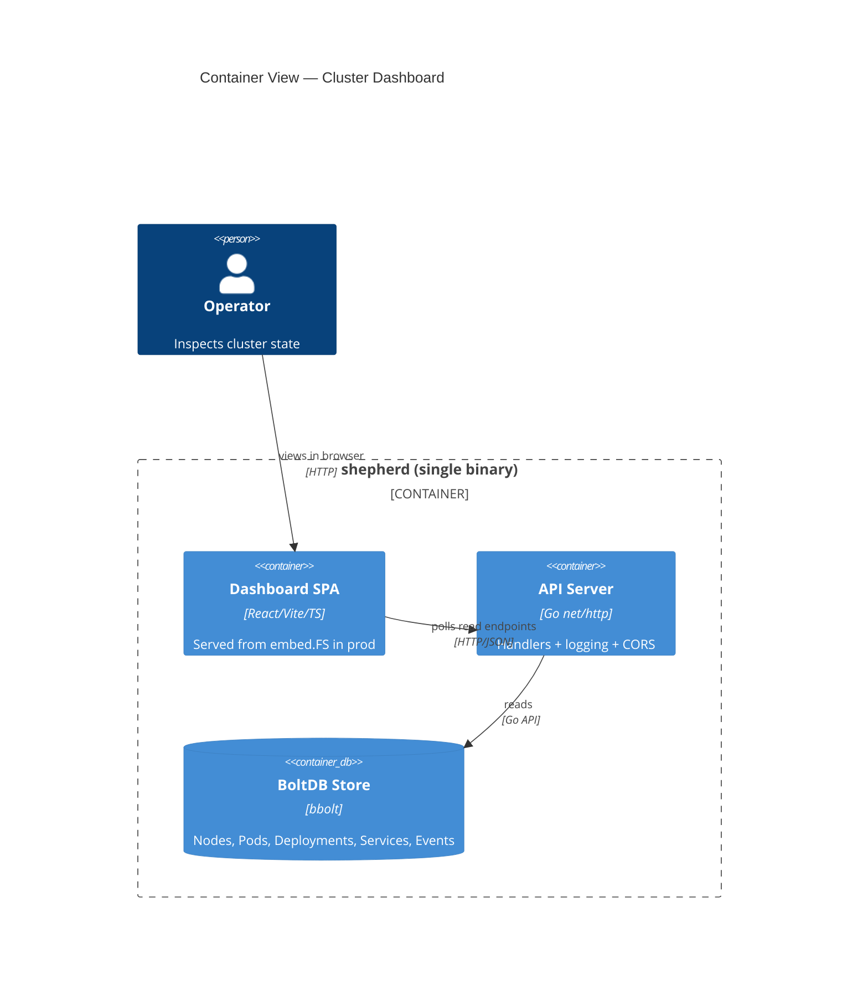
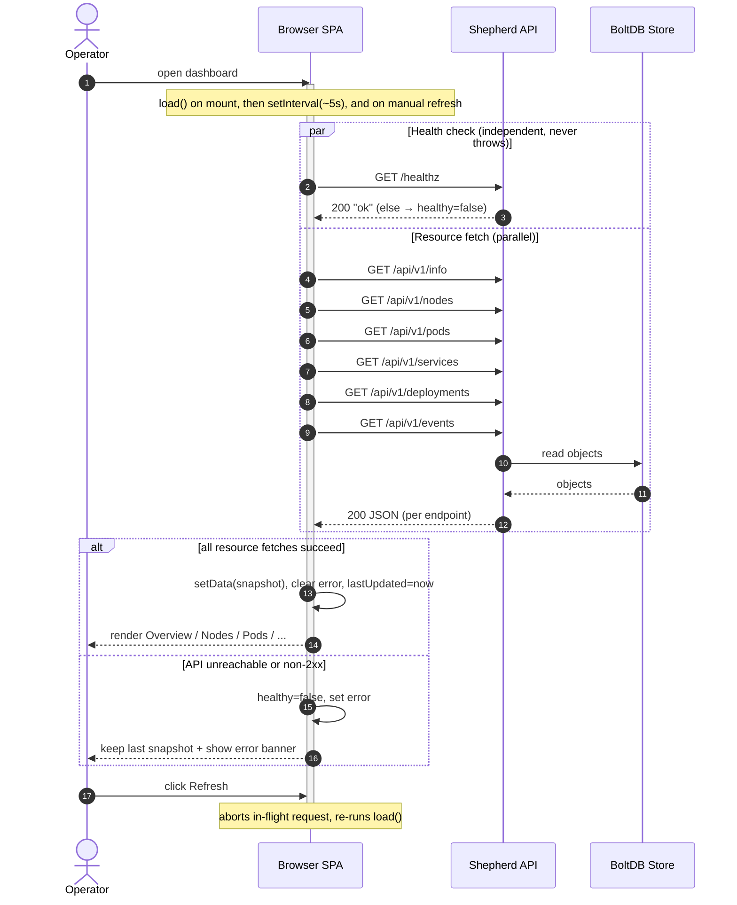
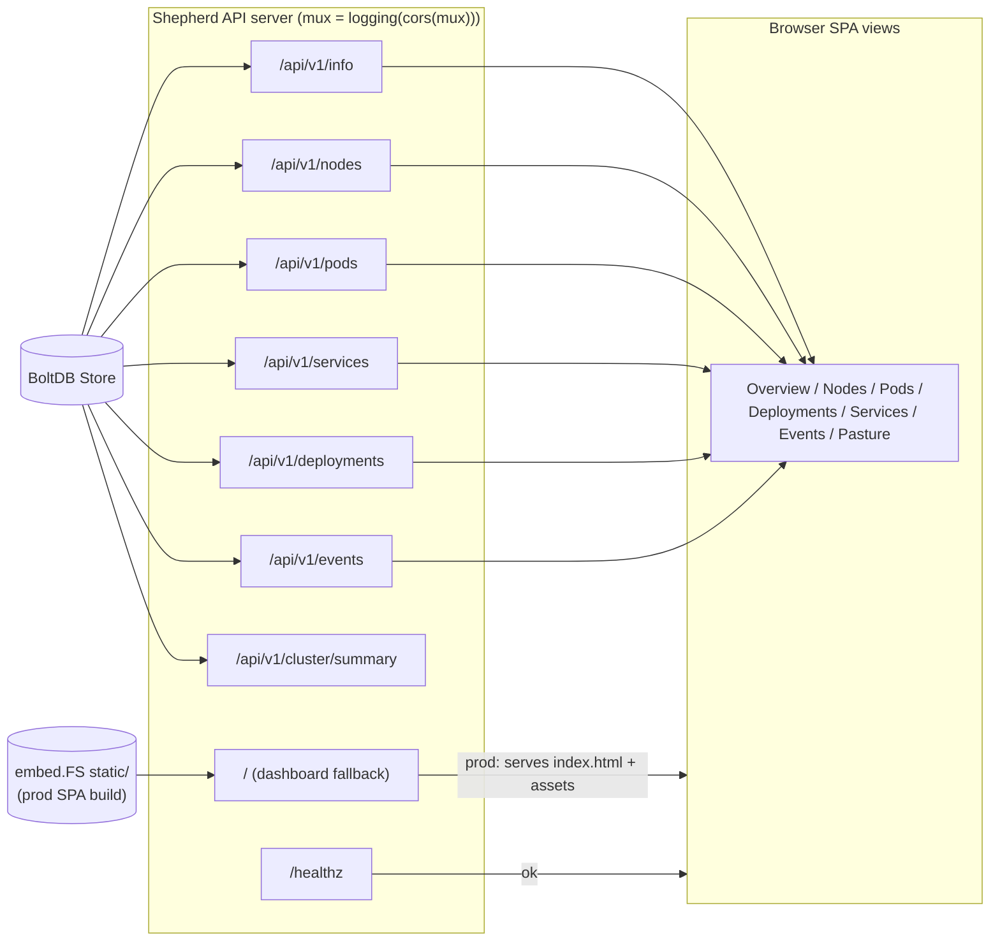
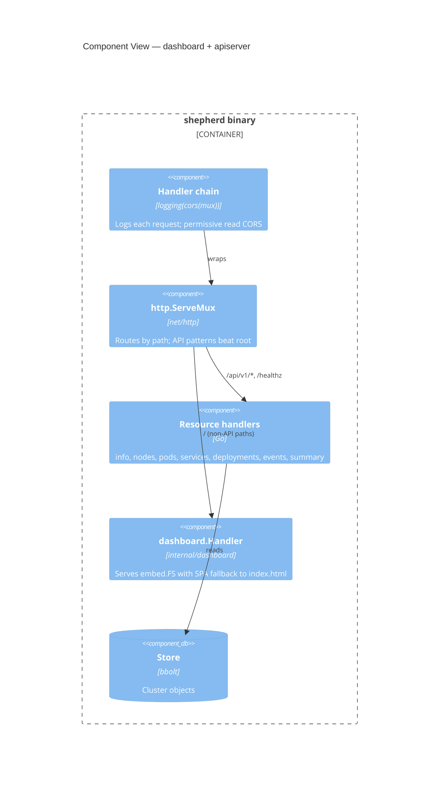

# PD-0001: Cluster Dashboard — Current Design

- **Status:** Accepted / Current
- **Author(s):** i.gorovoy
- **Created At:** 2026-07-01
- **Approved At:** —
- **Related Tasks:** —
- **Reviewers:** TBD

## Table of Contents

- [Purpose](#purpose)
- [Scope](#scope)
- [Business Context](#business-context)
- [Actors](#actors)
- [Process Flow](#process-flow)
- [Data Flow](#data-flow)
- [API Contract](#api-contract)
- [Business Rules](#business-rules)
- [Error Handling and Edge Cases](#error-handling-and-edge-cases)
- [Operational Considerations](#operational-considerations)
- [Security and Compliance](#security-and-compliance)
- [Resources](#resources)

## Purpose

Describe how the **cluster dashboard works today**: a monochrome, read-only web
SPA that visualises Shepherd cluster state (nodes, pods, deployments, services,
events) by polling the existing Shepherd REST API. Diagrams are the primary
source of truth; prose supports them.

## Scope

- **In scope:** the shipped dashboard — the `web/` React SPA, the
  `internal/dashboard` embed/serve handler, the CORS middleware, the
  `/api/v1/cluster/summary` endpoint, the polling client, and how prod vs. dev
  serving works.
- **Out of scope:** write/mutating flows (dashboard is read-only), auth, the
  scheduler/controllers themselves, the container runtime, the Meadow registry,
  and the future pasture visualization (see RFC-0002).

## Business Context

Operators previously had only `sheepctl` and raw JSON to inspect the cluster.
The dashboard gives a glanceable, on-theme view of control-plane state. It adds
**no new source of truth**: BoltDB remains authoritative, the API server remains
the single writer, and the dashboard is a pure read consumer.

## Actors

| Actor | Role |
|-------|------|
| **Operator** | Opens the dashboard in a browser to inspect cluster state. |
| **Browser SPA** | React/Vite app; polls the API, renders monochrome views, offers manual refresh. |
| **Shepherd API server** | Serves `/api/v1/*` + `/healthz` handlers and (in prod) the embedded SPA at `/`; wraps the mux with logging + CORS. |
| **BoltDB store** | Persistent desired/actual cluster state; read by API handlers. |

## Process Flow

The SPA mounts, then polls every resource endpoint in parallel roughly every
5s, plus on manual refresh. A separate, non-throwing health check drives the
connection indicator. On failure the last good snapshot stays on screen.

## Data Flow

State originates in BoltDB, is read by API handlers, serialized to JSON, and
rendered by SPA views. In production the same `shepherd` process also serves the
SPA assets from an embedded filesystem; the mux routes `/api/*` and `/healthz`
to handlers and everything else to the dashboard (with `index.html` fallback).

### Component view (internal/dashboard + apiserver mux)

## API Contract

All endpoints are `GET`, return JSON (except `/healthz`), under the base URL
(`VITE_SHEPHERD_API`, default `http://localhost:9876`). Types are defined in
`internal/shepherd/types.go`; `memory` is in **bytes**, `cpu` in **millicores**.

| Method | Path | Response | Notes |
|--------|------|----------|-------|
| GET | `/healthz` | `ok` (text/plain) | Liveness; drives the SPA connection indicator. |
| GET | `/api/v1/info` | `{ version, name, node_count, pod_count }` | Cluster summary counts. |
| GET | `/api/v1/nodes` | `Node[]` | Node condition, capacity/allocatable, pod_count, last_heartbeat. |
| GET | `/api/v1/pods` | `Pod[]` | `default` namespace via this path; phase in `status.phase`. |
| GET | `/api/v1/services` | `Service[]` | ClusterIP / NodePort, ports, endpoints. |
| GET | `/api/v1/deployments` | `Deployment[]` | Desired vs. ready/available replicas. |
| GET | `/api/v1/events` | `Event[]` | Last 100 events (Normal/Warning). |
| GET | `/api/v1/cluster/summary` | `{ info, nodes, pods, deployments, services, events }` | Aggregate convenience snapshot. |
| GET | `/` (and any non-API path) | SPA `index.html` / asset | Prod only; served from embed.FS with SPA fallback. |

CORS on all API responses: `Access-Control-Allow-Origin: *`,
`Access-Control-Allow-Methods: GET, OPTIONS`; preflight `OPTIONS` → `204`.

> Note: the shipped client fetches the six individual endpoints **in parallel**
> and assembles the summary client-side; `/api/v1/cluster/summary` exists as an
> equivalent single-request convenience.

## Business Rules

- Dashboard is **read-only**; it issues only `GET` requests.
- Pod phase (`Pending`/`Running`/`Succeeded`/`Failed`) and node condition
  (`Ready`/`NotReady`) are rendered in **monochrome only** — fill, border,
  stroke, hatch — never hue.
- The last successful snapshot remains visible during refetch and on error.

## Error Handling and Edge Cases

- **API unreachable / non-2xx:** client marks `healthy=false`, sets an error
  message, keeps the last snapshot, retries next poll.
- **Aborted in-flight request** (new poll or manual refresh): previous request
  is aborted; no state update from the aborted call.
- **Null arrays** from the API are normalized to `[]`.
- **Empty cluster:** views render empty states (e.g. "No nodes").

## Operational Considerations

- **Build for prod:** `make dashboard` → runs `web-build`
  (`npm install && vite build` in `web/`) → copies `web/dist` into
  `internal/dashboard/static` → `go build` shepherd with embedded assets.
  Serve the SPA and API from the single `shepherd` binary on `:9876`.
- **Build without a frontend:** `web-build`/`dashboard` skip gracefully when
  npm or `web/` is missing; a committed placeholder `index.html` keeps the Go
  build green.
- **Dev:** run `shepherd` (API on `:9876`) and, in `web/`, `npm run dev`
  (Vite on `:5173`). CORS permits the cross-origin calls.
- **Config:** `VITE_SHEPHERD_API` overrides the API base URL (default
  `http://localhost:9876`).
- **Polling:** ~5s interval + manual refresh; expect up to ~5s display lag.

## Security and Compliance

- Unauthenticated read of all cluster state. CORS is permissive but read-only
  (`GET, OPTIONS`). Bind to loopback / trusted networks until auth exists.
- No secrets are surfaced beyond what the existing API already returns.

## Resources

- `internal/dashboard/dashboard.go`
- `internal/shepherd/apiserver.go`, `internal/shepherd/types.go`
- `web/` (SPA), `web/src/hooks/useClusterData.ts`, `web/src/api/client.ts`
- `Makefile` (`web-build`, `dashboard`)
- `docs/dashboard.md` (backend notes)
- RFC-0001, ADR-0001, RFC-0002
