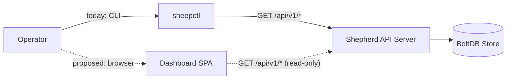
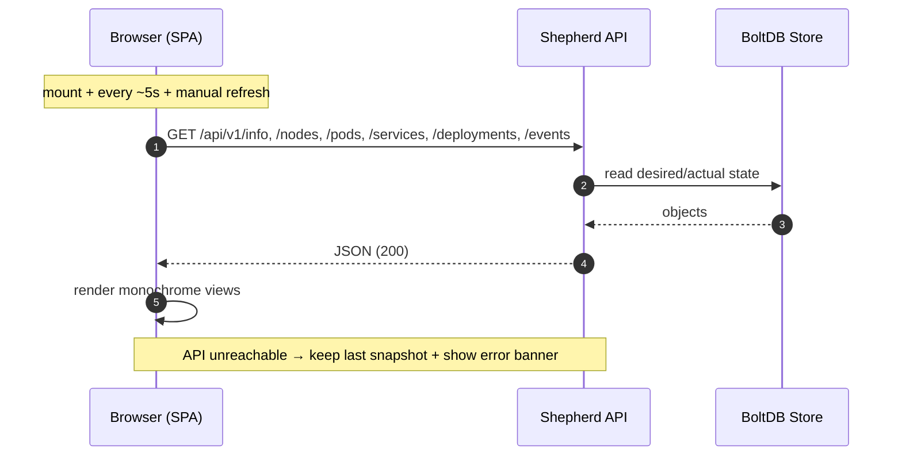

# RFC-0001: Cluster Dashboard

- **Status:** Proposed
- **Author(s):** i.gorovoy
- **Created At:** 2026-07-01
- **Approved At:** —
- **Related Tasks:** —
- **Reviewers:** TBD

## Table of Contents

- [Intro](#intro)
- [Background](#background)
- [Main Proposal](#main-proposal)
- [Alternative Considerations](#alternative-considerations)
- [Possible Improvements](#possible-improvements)
- [Impact and Dependencies](#impact-and-dependencies)
- [Risks](#risks)
- [Security](#security)
- [Resources](#resources)

## Intro

This RFC proposes adding a **cluster dashboard**: a monochrome, responsive,
read-only web UI that gives operators an at-a-glance visual view of the
Shepherd control plane — nodes, pods, deployments, services, and events — by
consuming the existing Shepherd REST API. It is delivered as a React/Vite SPA
that is embedded into and served by the `shepherd` binary.

## Background

Today Shepherd is CLI/daemon-only. The only way to inspect cluster state is
`sheepctl` (against `shepherd`'s REST API) or reading raw JSON from the
`/api/v1/...` endpoints. There is no visual, glanceable view of the cluster:

- No single screen showing node health, pod phases, deployment fill, and the
  recent event stream together.
- Demoing or debugging the platform requires memorising `sheepctl` invocations
  and mentally correlating separate command outputs.
- The project has a farm theme ("Sheep", "Shepherd", "Meadow") that a text CLI
  cannot express, and a future "pasture" visualization (see RFC-0002) needs a
  frontend surface to live in.

Crucially, the control-plane data is **already exposed** over HTTP/JSON. A
dashboard is purely a new *read* consumer; it introduces no new writer to the
store and no new source of truth.

## Main Proposal

Add a **read-only** web dashboard with these properties:

1. **Consumes the existing REST API only.** The SPA calls the current
   `GET /api/v1/{info,nodes,pods,services,deployments,events}` endpoints (plus
   `/healthz` and the aggregate `/api/v1/cluster/summary`). No new writes, no
   new store access path — the API server remains the single writer.
2. **Monochrome design system.** Strictly grayscale. Status (pod phase, node
   condition) is encoded via fill, border, stroke weight, and hatch — never
   hue. A light/dark toggle is monochrome on both ends. This keeps the UI
   legible, on-theme, and accessible without a colour palette.
3. **Polling, not streaming.** The SPA polls each resource endpoint roughly
   every 5s and offers a manual refresh. The last good snapshot stays on
   screen while a refetch is in flight.
4. **Embedded delivery.** The built SPA is embedded into the `shepherd` binary
   via `//go:embed` (package `internal/dashboard`) and served at `/`. API
   routes (`/api/...`, `/healthz`) take precedence; any other path falls back
   to `index.html` for client-side routing. Result: a single binary, no
   separate deploy, no extra process.
5. **Dev ergonomics via CORS.** In development the Vite dev server runs on
   `:5173` and calls the API on `:9876`; permissive CORS on the API
   (`Access-Control-Allow-Origin: *`, `GET, OPTIONS`, preflight → 204) makes
   this cross-origin call work. In production the SPA is same-origin, so CORS
   is a dev-only convenience.

Views: **Overview, Nodes, Pods, Deployments, Services, Events**, plus a
**Pasture** placeholder page reserved as the seam for the future farm
visualization (RFC-0002).

## Alternative Considerations

### (a) Go `html/template` server-rendered pages

- **Pros:** No JS toolchain; pure Go; renders in one round trip; trivially
  same-origin; smallest new-dependency surface.
- **Cons:** Interactivity (client-side routing, live polling without full page
  reloads, animated views) is awkward. The planned pasture visualization
  (animated node→pod grouping) is painful in server-rendered HTML. Poor fit for
  a rich, evolving read UI.

### (b) React + Vite + TypeScript SPA, embedded via `go:embed` (recommended)

- **Pros:** Rich component ecosystem for the interactive/animated pasture view;
  typed API client; client-side routing and polling are first-class; still
  ships as a **single binary** because assets are embedded, preserving the
  "one binary per component" ethos. Same-origin in prod.
- **Cons:** Introduces a JS/npm toolchain and a build step (`make dashboard`);
  a second language in the tree.

### (c) External / standalone UI (Grafana-style, separate service)

- **Pros:** Fully decoupled; could reuse an off-the-shelf dashboarding tool.
- **Cons:** Requires a metrics/TSDB layer we do not have; a separate deploy and
  lifecycle; heavyweight and off-theme for a from-scratch teaching platform;
  over-engineered for read-only cluster state.

**Recommendation: (b).** It preserves the single-binary deployment model via
embedding, keeps the API as the sole writer, and gives us the frontend richness
the farm-themed visualization needs. The cost — a JS toolchain gated behind a
Makefile target that skips gracefully when npm is absent — is acceptable and
contained. Stack specifics are recorded in ADR-0001.

## Possible Improvements

- **Write actions:** create/scale/delete via the existing POST/PUT/DELETE API
  (would require widening CORS methods and adding auth first).
- **Authentication / authorization:** the dashboard is currently unauthenticated
  (matching the API). Add auth before exposing writes or non-loopback binds.
- **Streaming instead of polling:** SSE or WebSocket push to replace the 5s
  poll, reducing latency and request volume.
- **Metrics & history:** time-series charts (CPU/memory trends) once a metrics
  pipeline exists.
- **Pasture visualization:** the farm-themed view (RFC-0002), plugging into the
  reserved `Pasture` page.

## Impact and Dependencies

- **New package** `internal/dashboard` (embed + SPA-fallback handler), mounted
  at `/` on the existing API mux.
- **New endpoint** `GET /api/v1/cluster/summary` (aggregate convenience).
- **CORS middleware** wrapping the API mux (`api.logging(api.cors(mux))`).
- **New `web/` frontend** (React 18 + Vite 5 + TS; only extra runtime dep is
  `react-router-dom`).
- **Makefile targets** `web-build` and `dashboard` (npm install + vite build →
  copy `web/dist` into `internal/dashboard/static` → build shepherd with
  embedded assets). Both skip gracefully when npm or `web/` is absent, so the
  Go tree still builds with a committed placeholder `index.html`.
- **No change** to the reconciliation model, the store, controllers, scheduler,
  or the OCI surfaces. The dashboard is a pure read consumer of the control
  plane.

## Risks

- **Toolchain drift / build fragility:** npm + Vite add a build path outside Go.
  Mitigated by the graceful-skip Makefile logic and a committed placeholder.
- **Stale/inconsistent view:** 5s polling means the UI can lag reality and
  different resources can be a poll apart. Acceptable for a read-only view;
  documented as eventual-consistency of display.
- **Security exposure:** unauthenticated read of all cluster state. Bind to
  loopback / trusted networks until auth exists; do not add writes without auth.
- **Embed bloat:** SPA assets increase the `shepherd` binary size. Small and
  acceptable for a single embedded SPA.

## Security

- Read-only; no mutating endpoints reachable from the SPA.
- CORS is permissive but scoped to `GET, OPTIONS` — no credentialed writes.
- No authn/authz yet; treat the dashboard/API as trusted-network only.

## Resources

- Backend: `internal/dashboard/dashboard.go`, `internal/shepherd/apiserver.go`
- Types: `internal/shepherd/types.go`
- Frontend: `web/`
- Build: `Makefile` (`web-build`, `dashboard`)
- Stack decision: `docs/adr/ADR-0001-dashboard-stack.md`
- Current-state design: `docs/pd/PD-0001-cluster-dashboard.md`
- Next step: `docs/rfc/RFC-0002-pasture-visualization.md`
