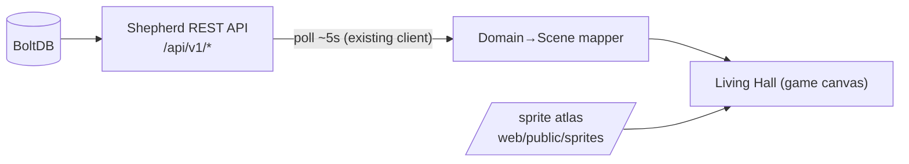
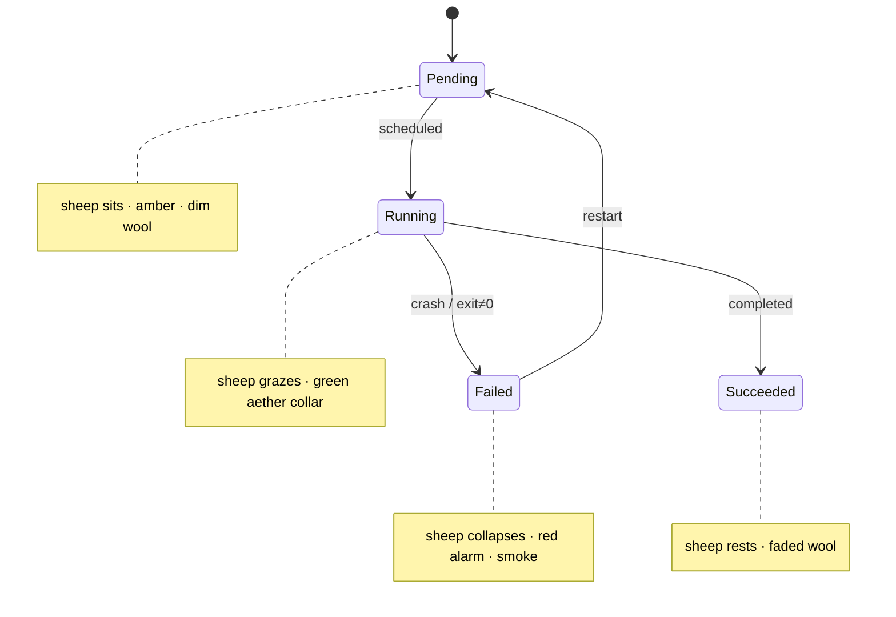

# RFC-0002 — The Living Hall: Gamified Cluster Visualization

- **Status:** Draft
- **Author(s):** i.gorovoy
- **Created At:** 2026-07-02
- **Approved At:** —
- **Related Tasks:** —
- **Reviewers:** TBD
- Supersedes: RFC-0002 (pasture visualization, monochrome) — retired.

## Table of Contents
1. Intro
2. Background
3. Main Proposal
4. Alternative Considerations
5. Possible Improvements
6. Impact and Dependencies
7. Risks

## Intro

Turn the Shepherd cluster overview into a **living, playable scene** rendered in a Warcraft‑III / steampunk‑dwarf art style: an underground **dwarven forge hall** where dwarf engineers tend a flock of sheep. Every element is bound to a real cluster object, so the scene is a control plane you can *read at a glance*, not decoration.

The world → cluster binding (the contract the whole feature rests on):

| Game element | Cluster object | Encodes |
|---|---|---|
| Dwarf engineer | Node agent / role | tending = healthy · slumped/offline = NotReady |
| Sheep | Pod / container | phase: running / pending / failed / succeeded |
| Forge station | Node | capacity (CPU/mem), pod count |
| Steam‑core | Shepherd control plane | cluster load |
| Runic vault | Meadow registry | repos / images |
| Parchment ledger | Events (last 100) | Normal / Warning |
| Stray pen | Unscheduled pods | pods with no `node_name` |

## Background

Shepherd is CLI/daemon‑first; the dashboard (RFC‑0001, ADR‑0001, PD‑0001) added a read‑only React/Vite SPA over the existing REST API. That SPA is tables and cards. The owner wants the cluster **gamified** in the project's established steampunk/dwarf visual identity (see `docs/blog/posts/assets` reference art): a scene that makes cluster state legible and delightful, and that grows a story around the sheep/shepherd/meadow domain.

This RFC covers the visualization only. It reuses the existing data path — no backend change is required.

## Main Proposal

A **2D isometric, sprite‑animated scene** embedded in the SPA at the `Pasture` seam (`web/src/pages/Pasture.tsx`), driven by the same polled cluster summary.

- **Rendering:** a game canvas (engine chosen in ADR‑0002) drawing an isometric stone hall floor, forge stations, a central steam‑core, the runic vault, and a stray pen.
- **Actors:** dwarf‑engineer sprites man each station; sheep sprites graze per node (grouped by `pod.spec.node_name`). Pod phase drives the sheep animation/state; node `status.condition` drives the dwarf and the station lamp; node capacity drives a gauge; running/total drives the steam‑core intensity.
- **Game loop:** a fixed‑step loop interpolates between data snapshots. On each poll, the mapper diffs the previous scene and animates transitions — new pod → a sheep walks in; pod failed → sheep collapses + red alarm + smoke; pod removed → sheep leaves; node NotReady → dwarf slumps, station dims.
- **Interaction:** hover/click a sheep → pod detail; click a station → node detail; the scene is a view alongside (not replacing) the existing tables.
- **Assets:** AI‑generated PNG sprites (Gemini/DALL·E) packed into texture atlases under `web/public/sprites/…`, per the sprite kit (`docs/design/DESIGN-0002-forge-sprite-kit.md`) and loaded via a manifest.

State → animation mapping:

Delivery is phased (see the visual proposal artifact): **Phase 1** forge skin on the existing views, **Phase 2** the data‑driven Forge Floor overview, **Phase 3** this fully animated Living Hall. This RFC targets Phase 3 as the north star; earlier phases are stepping stones that ship value sooner.

## Alternative Considerations

- **Static illustration vs live scene.** A single hero illustration is cheap but dead — it can't show state. Rejected as the primary; retained as loading/empty art.
- **DOM/CSS + SVG (the mockup approach)** vs a **game canvas.** DOM scales and is accessible but struggles with many animated actors, z‑ordering in isometric space, and a real game loop. For dozens of moving sheep/dwarves, a canvas engine wins. Chosen: game canvas (ADR‑0002).
- **Vector (SVG) sprites vs AI‑generated raster sprites.** Vector is light and recolorable but can't match the painted WC3 look. Decision: **AI‑generated raster** sprites in atlases (owner's call), with vector kept only for HUD chrome/gauges.
- **New backend aggregation for the scene.** Unnecessary — the existing endpoints + client summary already provide nodes, pods, events, capacity. No new API.

## Possible Improvements

- Idle "life" — dwarves hammer, sheep wander, steam puffs — even when data is unchanged.
- Sound (optional, off by default): forge clanks, bleats, alarm klaxon on Warning events.
- History scrubber — replay the last N snapshots.
- Accessibility twin — the tables remain the canonical, screen‑reader‑friendly view; the scene is the ambient/at‑a‑glance layer.
- Theming hooks for future factions (e.g. different node pools as different dwarf clans).

## Impact and Dependencies

- **Frontend only.** New scene module under `web/src/`, a domain→scene mapper, and assets under `web/public/sprites/`. Existing views untouched.
- **Depends on:** ADR‑0002 (engine), DESIGN‑0002 (sprite kit + generated assets), and the existing polled cluster data.
- **Build/size:** raster atlases add weight to `web/dist`; must be optimized (see Risks). Embedding into the Go binary (`internal/dashboard/static`) grows the binary accordingly.

## Risks

- **Asset weight.** Painted PNG atlases can be large. Mitigation: cap resolution (@2x tokens ~256px), compress (WebP where the engine supports it, else optimized PNG), lazy‑load non‑critical atlases, budget total scene assets (target < ~2–3 MB).
- **Style consistency across generated sprites.** AI generations drift. Mitigation: a fixed style anchor prompt, a seed/reference image, and a review pass (DESIGN‑0002).
- **Performance with large clusters.** Hundreds of pods = hundreds of sprites. Mitigation: sprite pooling, culling off‑screen actors, aggregate "N sheep" tokens past a threshold.
- **Scope.** Living Hall is large; the phased plan de‑risks by shipping the skin and static floor first.
- **Accessibility.** A canvas game is not screen‑readable. Mitigation: keep the existing tables as the canonical view; the scene is supplementary.
