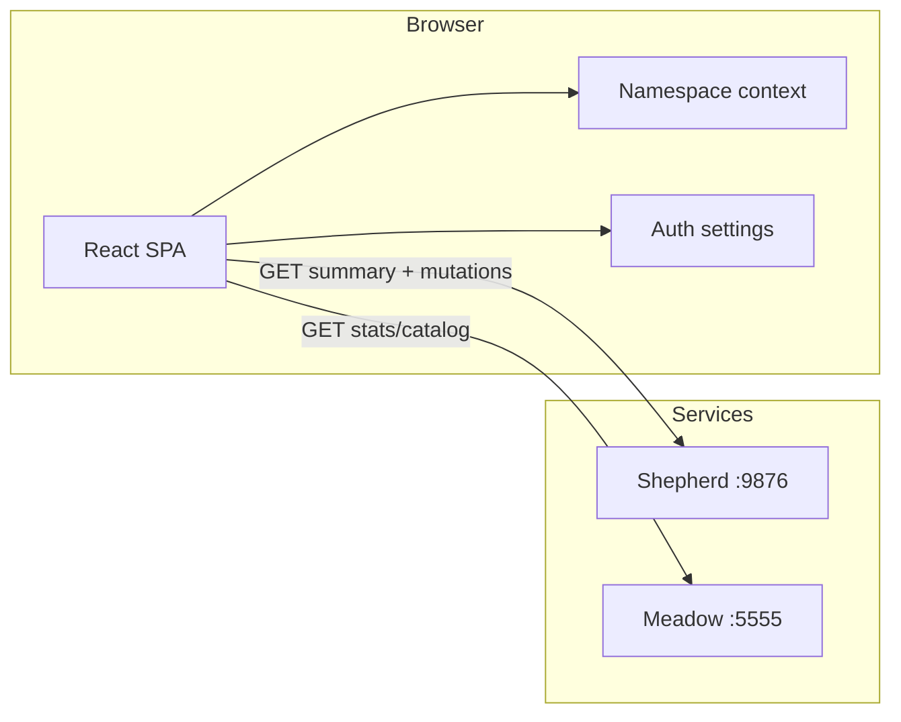
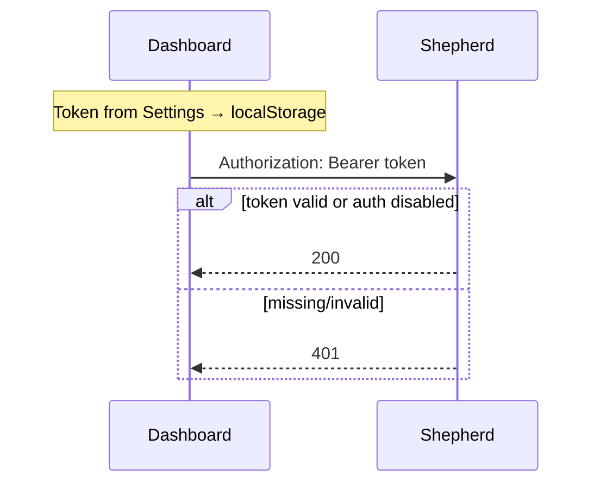

# RFC-0003: Cluster Management UI

- **Status:** Accepted / Implemented (Phases 1–3)
- **Author(s):** i.gorovoy
- **Created At:** 2026-07-07
- **Approved At:** 2026-07-07
- **Related Tasks:** —
- **Reviewers:** TBD
- **Supersedes:** Partial scope of RFC-0001 improvements, RFC-0002 interaction layer

## Table of Contents

- [Intro](#intro)
- [Background](#background)
- [Goals](#goals)
- [Phased Delivery](#phased-delivery)
- [Architecture](#architecture)
- [API Changes](#api-changes)
- [Frontend Design](#frontend-design)
- [Auth Model (Phase 2)](#auth-model-phase-2)
- [Meadow UI (Phase 3)](#meadow-ui-phase-3)
- [Risks](#risks)
- [Resources](#resources)

## Intro

Complete the Shepherd **cluster management frontend**: evolve the read-only
dashboard (RFC-0001) into a full operator UI with resource detail pages,
namespace filtering, write operations, Bearer token auth, and a Meadow registry
view. Living Hall (RFC-0002) gains click-through navigation to resource details.

## Background

The shipped dashboard (`web/`) provides monochrome list views and a Phaser-based
Living Hall. `sheepctl` already exposes full CRUD against the Shepherd REST API.
The UI covers ~40% of CLI capabilities — lists only, `default`-biased data
paths, no mutations, no Meadow surface.

Decisions for this epic:

| Decision | Choice |
|----------|--------|
| Delivery | Phased 1 → 2 → 3 |
| Auth | Bearer token (`SHEPHERD_API_TOKEN` / runtime localStorage) |
| Meadow | Full registry UI (catalog, tags, stats, pull hints) |

## Goals

1. **Read parity** with `sheepctl get` / `describe` (Phase 1).
2. **Write parity** with `apply`, `scale`, `delete` (Phase 2).
3. **Meadow operator view** for image registry (Phase 3).
4. Preserve monochrome design system and table-first accessibility (RFC-0002).

## Phased Delivery

### Phase 1 — Read-only parity (this implementation start)

- Fix `GET /api/v1/cluster/summary` to list all namespaces for pods, services,
  deployments.
- Add `GET /api/v1/namespaces`; include `namespaces` in summary response.
- Support `?namespace=all|<name>` on summary.
- Namespace selector in top bar (persisted in `localStorage`).
- Single summary poll replaces six parallel GETs.
- Detail routes: `/nodes/:name`, `/pods/:ns/:name`, `/deployments/:ns/:name`,
  `/services/:ns/:name`.
- Clickable table rows; Living Hall click → detail navigation.
- Pod detail: container states (equivalent to `sheepctl logs` metadata).

### Phase 2 — Write operations + auth

- `SHEPHERD_API_TOKEN` middleware on Shepherd (opt-in; disabled when unset).
- CORS: `GET, POST, PUT, DELETE, OPTIONS`.
- Settings panel: API URL + token (runtime `localStorage`, not `VITE_*`).
- Apply JSON drawer, scale deployment, delete with name confirmation.
- Toast feedback; refresh after mutation.

### Phase 3 — Meadow registry UI

- CORS + optional `MEADOW_API_TOKEN` on Meadow (`:5555`).
- Routes: `/meadow`, `/meadow/repos/:name`.
- Client: `/v2/_catalog`, `/v2/{repo}/tags/list`, `/meadow/stats`.
- Living Hall vault links to Meadow; vault glow from repo count.
- Pull command copy; optional tag delete.

## Architecture



**Principles:**

- API / BoltDB remain the single source of truth.
- Tables stay the canonical accessible view; Living Hall is supplementary.
- Polling retained in Phases 1–2; SSE optional later.

## API Changes

### Phase 1 (Shepherd)

| Endpoint | Change |
|----------|--------|
| `GET /api/v1/cluster/summary` | All namespaces; `?namespace=` filter; `namespaces` field |
| `GET /api/v1/namespaces` | New — unique namespaces from store keys |

### Phase 2 (Shepherd)

| Change | Detail |
|--------|--------|
| CORS methods | Add `POST`, `PUT`, `DELETE` |
| Auth middleware | `Authorization: Bearer <token>` when `SHEPHERD_API_TOKEN` set |

### Phase 3 (Meadow)

| Change | Detail |
|--------|--------|
| CORS | Same pattern as Shepherd |
| Auth | `MEADOW_API_TOKEN` optional Bearer |

## Frontend Design

### Routes (Phase 1+)

```
/  /nodes  /nodes/:name
/pods  /pods/:ns/:name
/deployments  /deployments/:ns/:name
/services  /services/:ns/:name
/events  /pasture
/meadow  /meadow/repos/:name   (Phase 3)
```

### Detail page layout

- Breadcrumb back link.
- Summary cards (phase, node, replicas, …).
- Tabs: Overview | Spec | Status | Events (where applicable).
- JSON viewers for spec/status (`JsonBlock`).

### New modules

```
web/src/
  hooks/useNamespace.ts
  hooks/useResource.ts
  components/NamespaceSelect.tsx
  components/Breadcrumb.tsx
  components/JsonBlock.tsx
  components/DetailTabs.tsx
  pages/detail/*.tsx
```

## Auth Model (Phase 2)



- Server: `SHEPHERD_API_TOKEN` env; empty = no auth (backward compatible).
- Client: never bake token into `VITE_*` build vars.

## Meadow UI (Phase 3)

| Page | Data |
|------|------|
| Overview | `GET /meadow/stats` |
| Repo detail | `GET /meadow/stats/{repo}`, `GET /v2/{repo}/tags/list` |

Settings: `VITE_MEADOW_API` default `http://localhost:5555`, Meadow token in
localStorage.

## Risks

| Risk | Mitigation |
|------|------------|
| Token in localStorage | Document trusted-network-only |
| Meadow cross-origin | CORS + configurable URL |
| Phaser + React Router | `navigate` callback from React, no full reload |
| Summary inconsistency | Fixed in Phase 1 first commit |

## Resources

- RFC-0001: `docs/rfc/RFC-0001-cluster-dashboard.md`
- RFC-0002: `docs/rfc/RFC-0002-living-hall.md`
- PD-0001: `docs/pd/PD-0001-cluster-dashboard.md`
- Backend: `internal/shepherd/apiserver.go`, `internal/shepherd/store.go`
- Frontend: `web/src/`
- Meadow: `internal/registry/server.go`
