# Sheep Internals

Container runtime architecture, Linux isolation primitives, and networking.

## Table of Contents

- [Container Lifecycle](#container-lifecycle)
- [Linux Isolation Stack](#linux-isolation-stack)
- [Re-Exec Pattern](#re-exec-pattern)
- [Namespace Configuration](#namespace-configuration)
- [Cgroups v2 Resource Control](#cgroups-v2-resource-control)
- [Overlay Filesystem](#overlay-filesystem)
- [Container Networking](#container-networking)
- [Image Management](#image-management)
- [Filesystem Layout](#filesystem-layout)

## Container Lifecycle

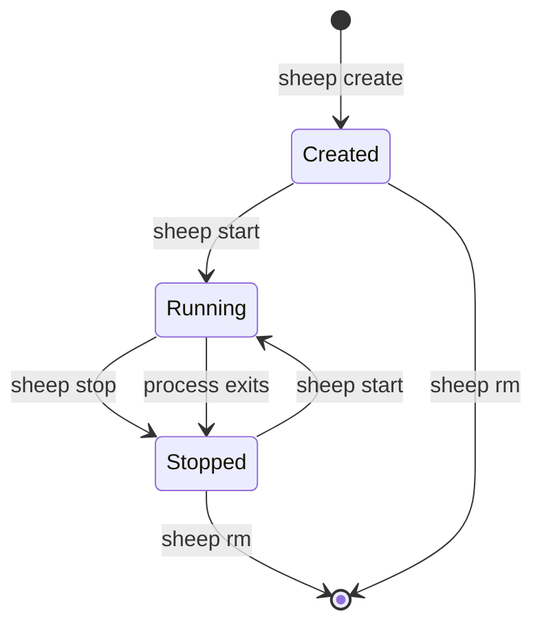

### Detailed Lifecycle Sequence

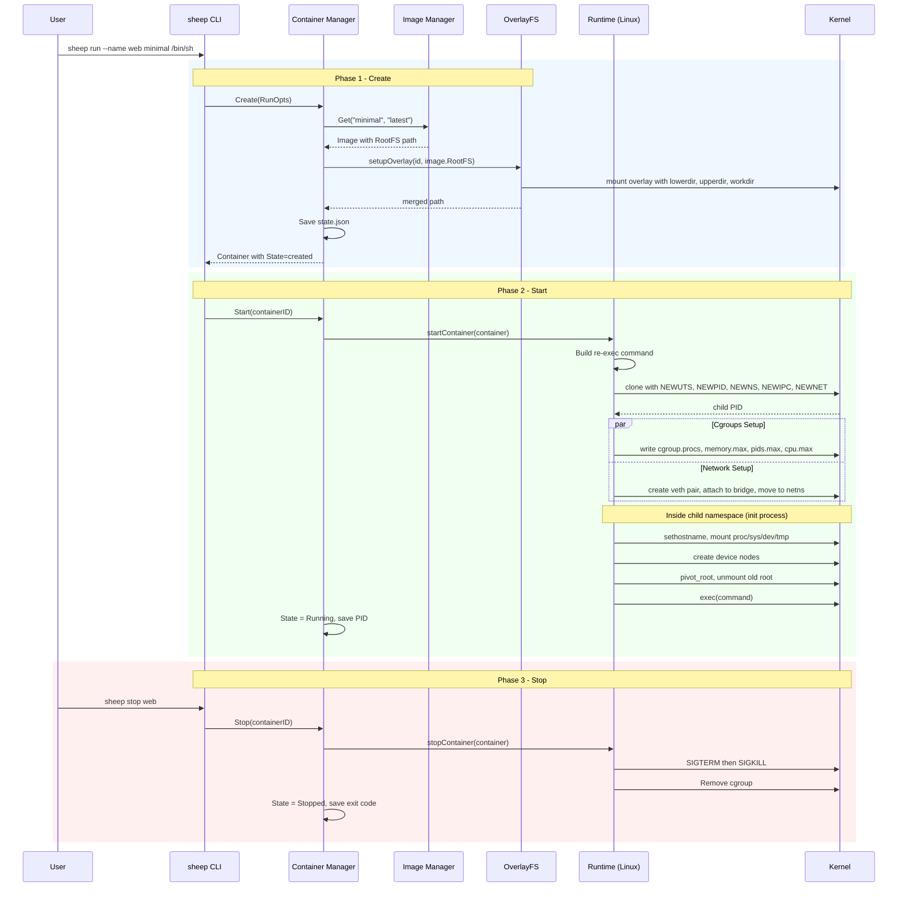

## Linux Isolation Stack

Each container runs in its own set of Linux namespaces with cgroup resource limits applied.

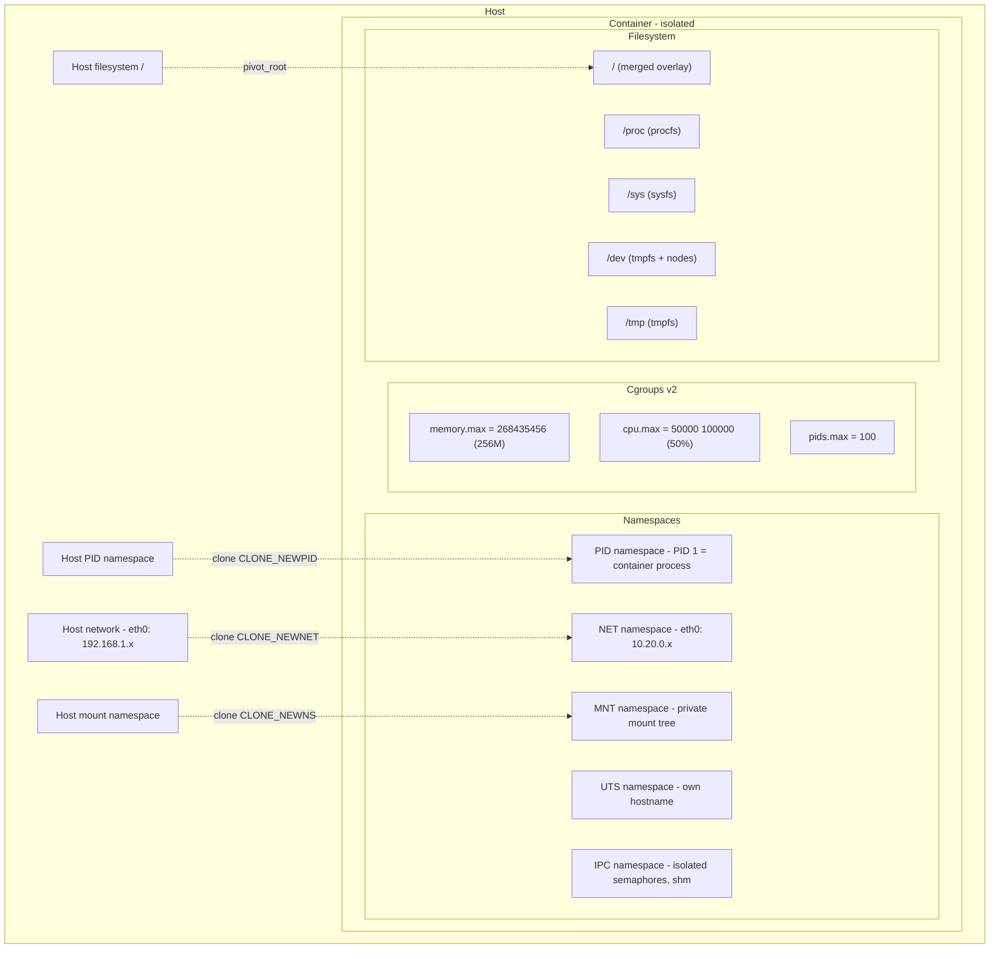

### Namespace Isolation Matrix

| Namespace | Flag | Isolates | Effect |
|-----------|------|----------|--------|
| PID | `CLONE_NEWPID` | Process IDs | Container process is PID 1 |
| NET | `CLONE_NEWNET` | Network stack | Own interfaces, IPs, routing table |
| MNT | `CLONE_NEWNS` | Mount points | Private filesystem mount tree |
| UTS | `CLONE_NEWUTS` | Hostname | Own hostname and domain name |
| IPC | `CLONE_NEWIPC` | IPC primitives | Isolated semaphores, message queues, shared memory |

## Re-Exec Pattern

Go uses threads internally (goroutines mapped to OS threads). Linux `clone()` only copies the calling thread into the new namespace, leaving Go's runtime in an inconsistent state. The re-exec pattern solves this:

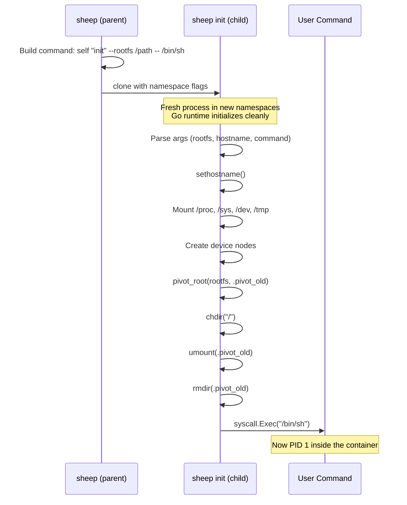

## Cgroups v2 Resource Control

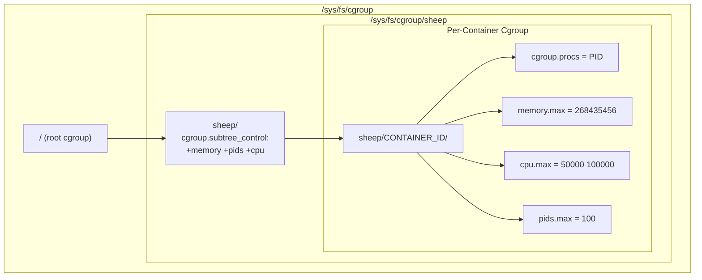

### Resource Limit Mapping

| Sheep Flag | Cgroup v2 File | Value Format | Example |
|-----------|---------------|-------------|---------|
| `-m 256m` | `memory.max` | bytes | `268435456` |
| `--cpu-quota 50000` | `cpu.max` | `$QUOTA $PERIOD` | `50000 100000` (50%) |
| `--cpu-shares 512` | `cpu.weight` | 1-10000 | `19` (mapped from Docker-style) |
| `--pids-limit 100` | `pids.max` | integer | `100` |

## Overlay Filesystem

OverlayFS provides copy-on-write layering: the image rootfs is read-only, and each container gets a writable layer on top.

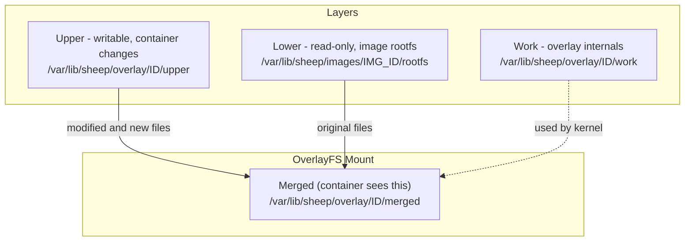

### Read/Write Flow

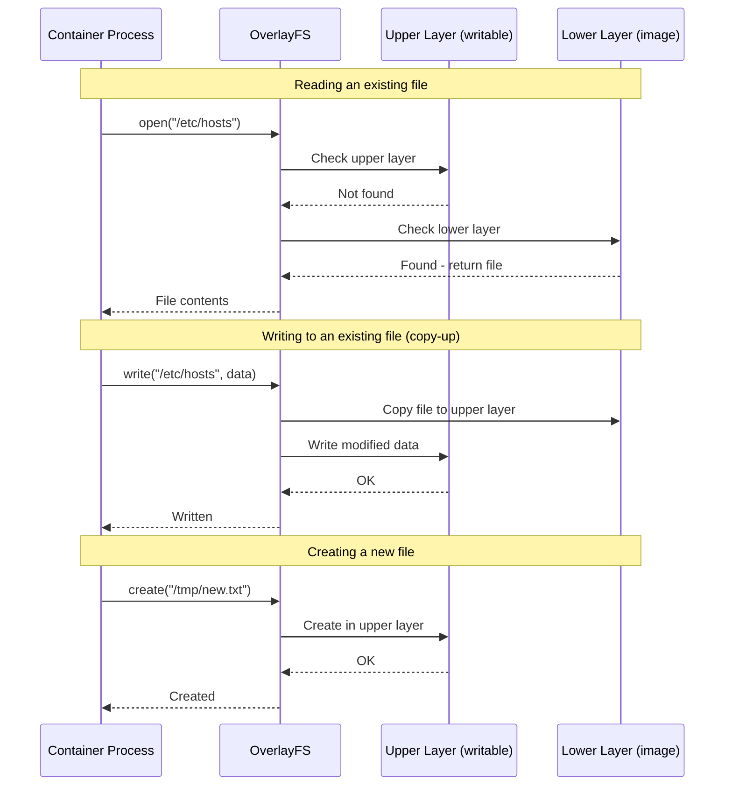

## Container Networking

### Bridge Network Architecture

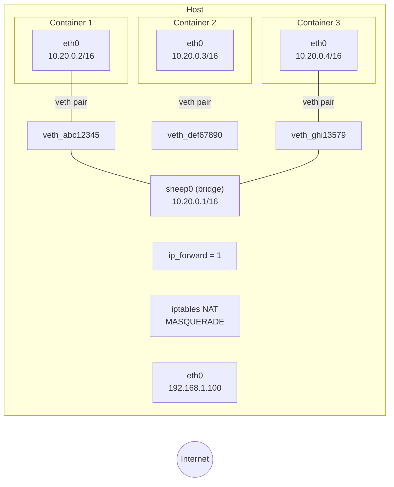

### Network Setup Sequence

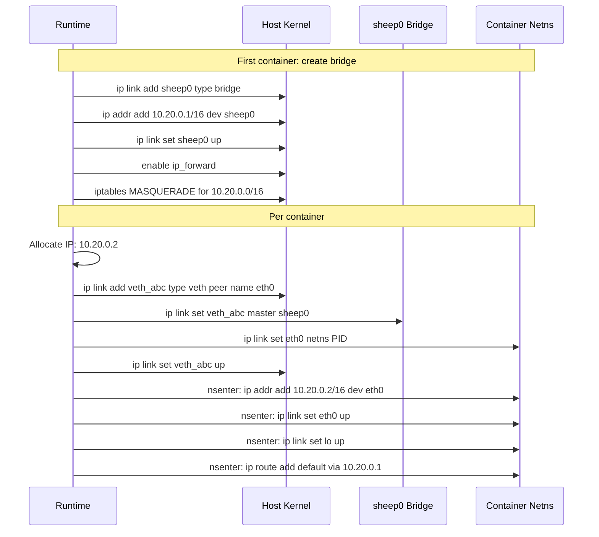

### Traffic Flow: Container to Internet


### Traffic Flow: Container to Container (same host)

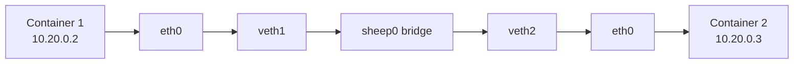

## Image Management

### Image Operations

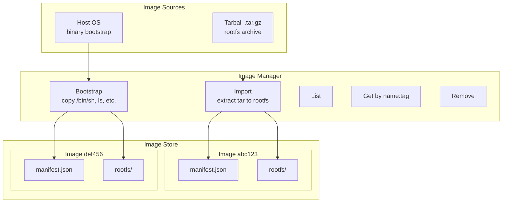

## Filesystem Layout

```
/var/lib/sheep/
|-- containers/
|   +-- {container_id}/
|       +-- state.json              # Container metadata and state
|-- overlay/
|   +-- {container_id}/
|       |-- upper/                  # Writable layer
|       |-- work/                   # OverlayFS workdir
|       +-- merged/                 # Merged view (container rootfs)
|-- images/
|   +-- {image_id}/
|       |-- manifest.json           # Image metadata
|       +-- rootfs/                 # Image filesystem
|           |-- bin/
|           |-- etc/
|           |-- lib/
|           |-- proc/               # Mount point
|           |-- sys/                # Mount point
|           +-- ...
+-- network/
    +-- ip_counter                  # IP allocation state
```
