# Shepherd Internals

Orchestrator architecture, scheduling algorithms, controller reconciliation loops, and cluster management.

## Table of Contents

- [Control Plane Architecture](#control-plane-architecture)
- [API Server](#api-server)
- [Scheduler](#scheduler)
- [Controller Manager](#controller-manager)
- [Node Agent](#node-agent)
- [Pod Lifecycle in Cluster](#pod-lifecycle-in-cluster)
- [Deployment Scaling Flow](#deployment-scaling-flow)
- [Health Monitoring](#health-monitoring)

## Control Plane Architecture

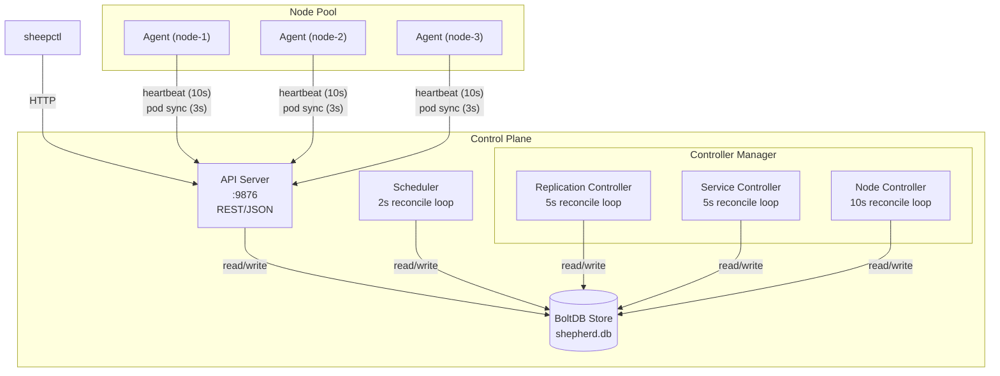

### Component Responsibilities

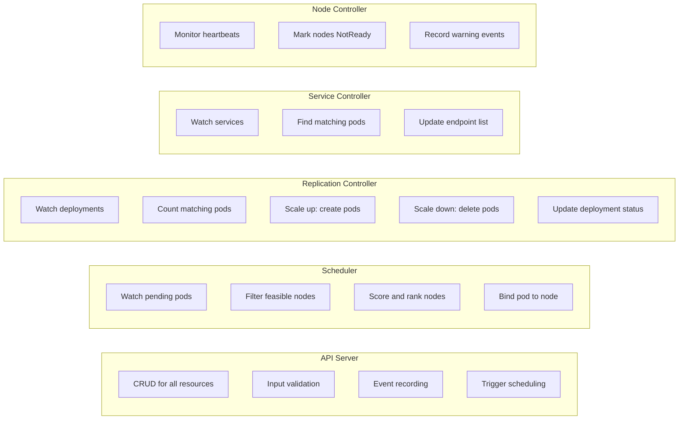

## API Server

### Endpoint Map

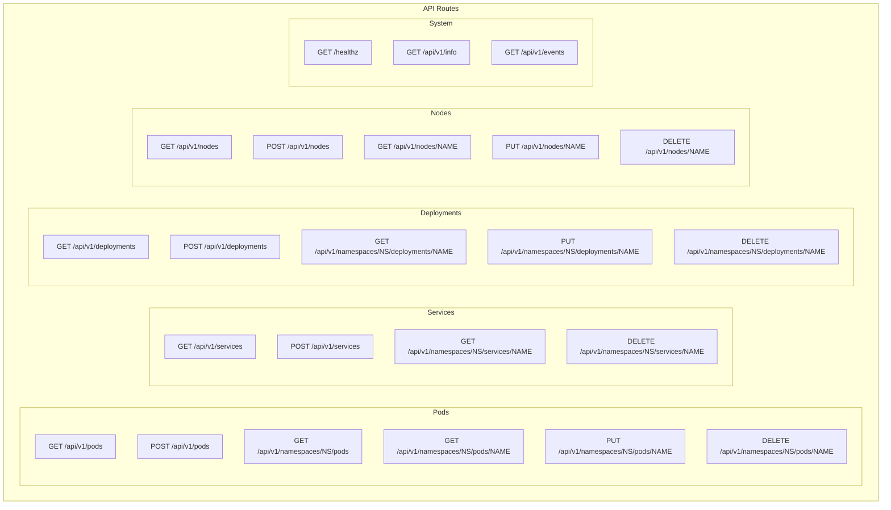

### Request Flow

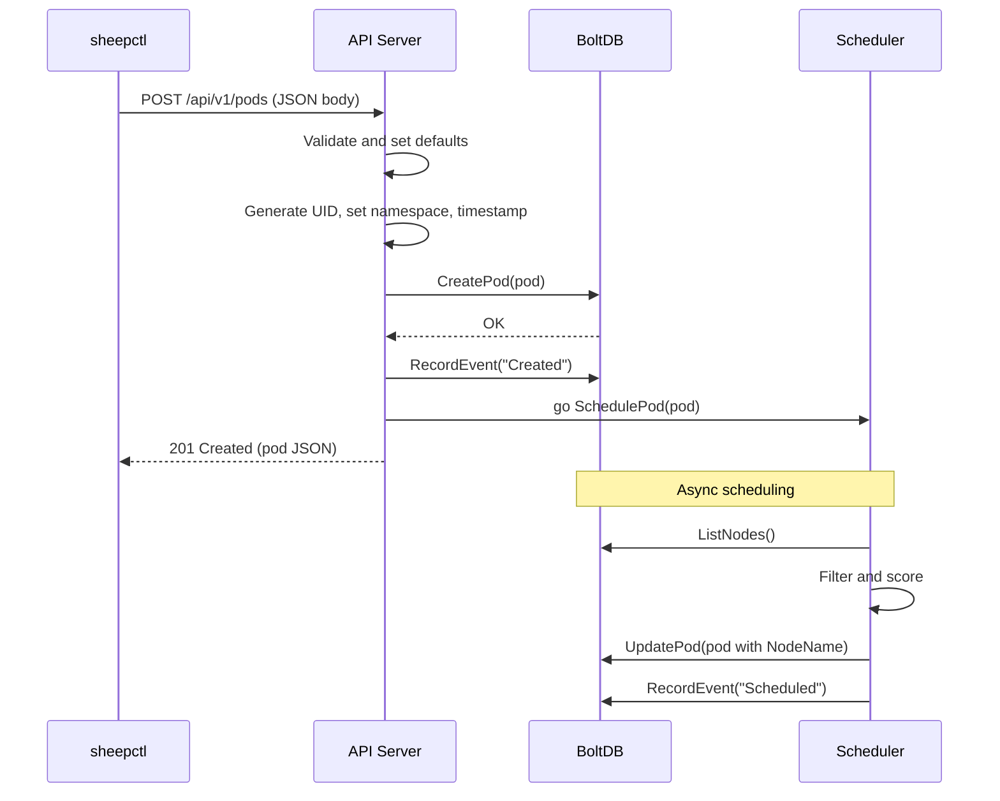

## Scheduler

### Scheduling Algorithm

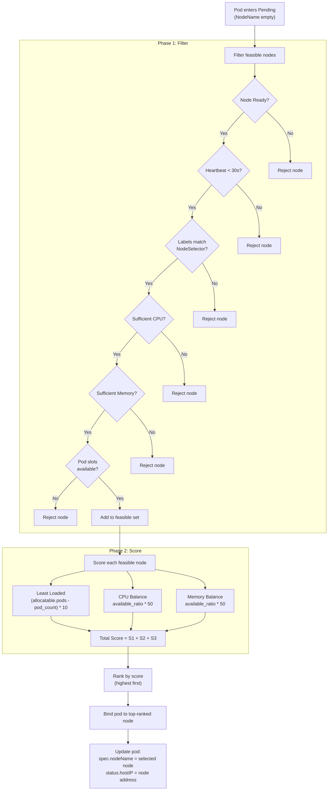

### Scheduling Example

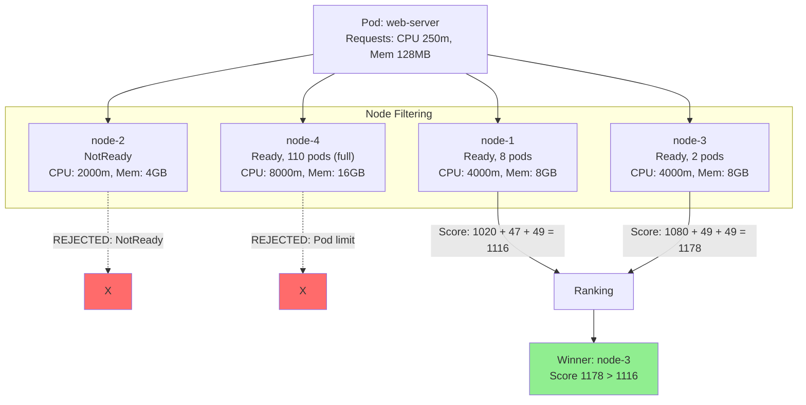

## Controller Manager

### Reconciliation Loop Pattern

All controllers follow the same pattern: observe desired state, compare with actual state, take action to converge.

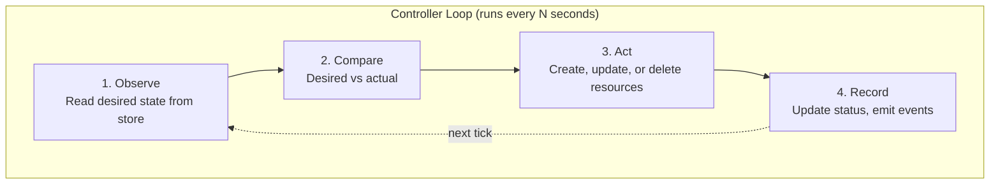

### Replication Controller Flow

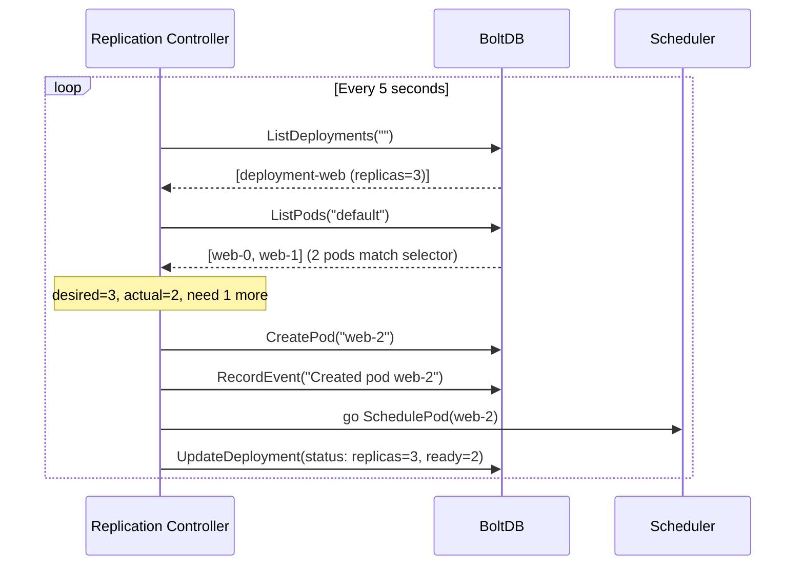

### Scale Down Flow

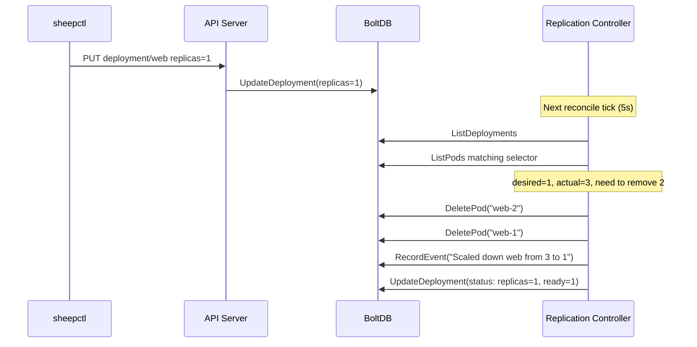

### Service Controller Flow

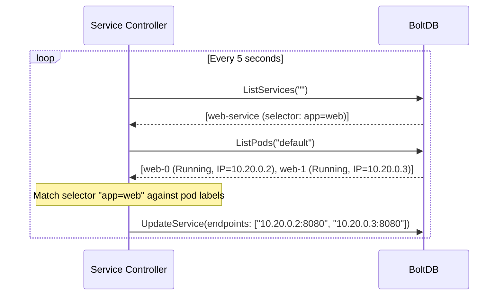

## Node Agent

### Agent Lifecycle

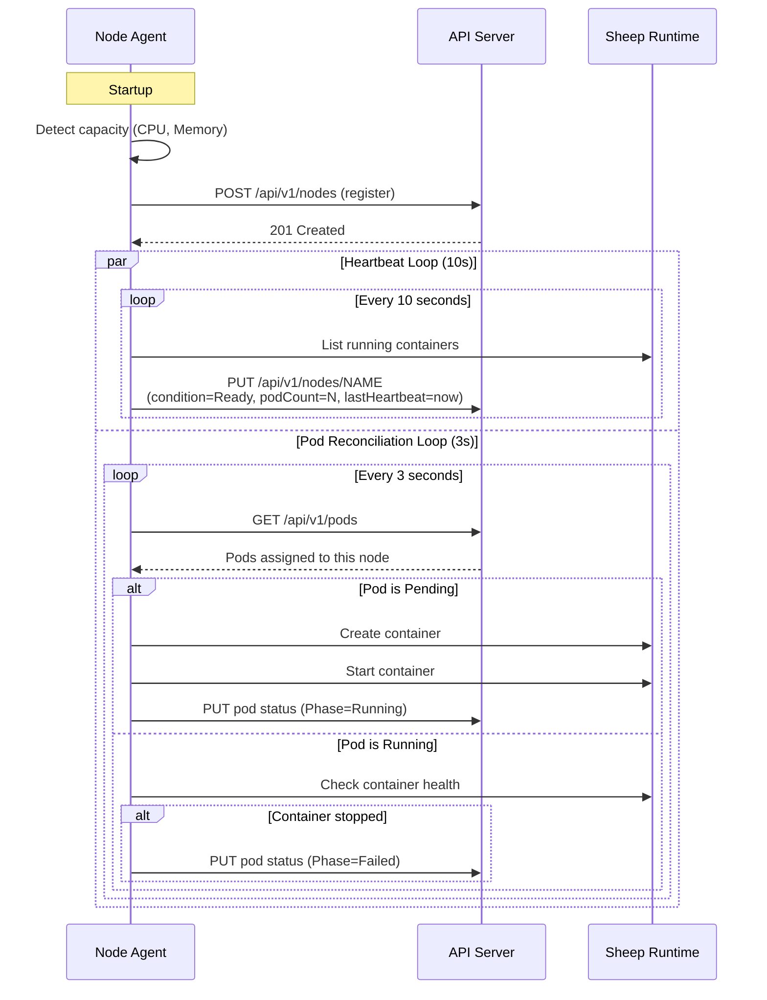

### Agent Pod Start Sequence

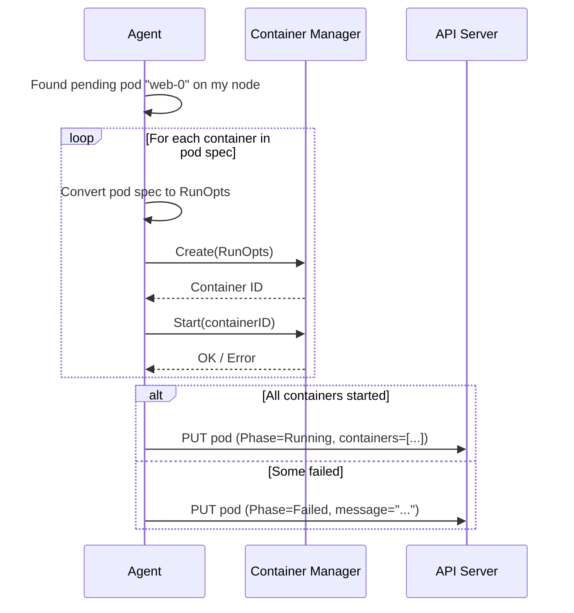

## Pod Lifecycle in Cluster

End-to-end flow from `sheepctl apply` to running container.

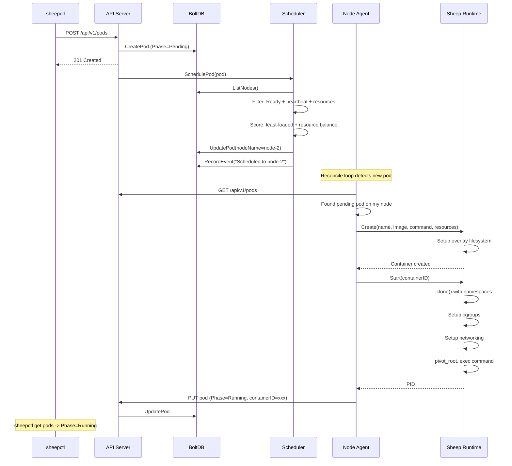

## Deployment Scaling Flow

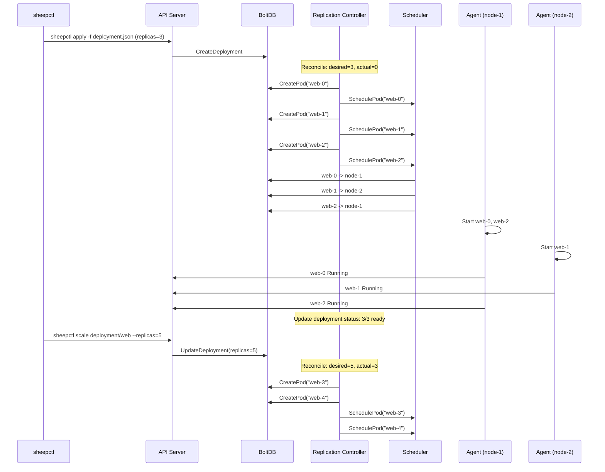

## Health Monitoring

### Heartbeat and Node Health

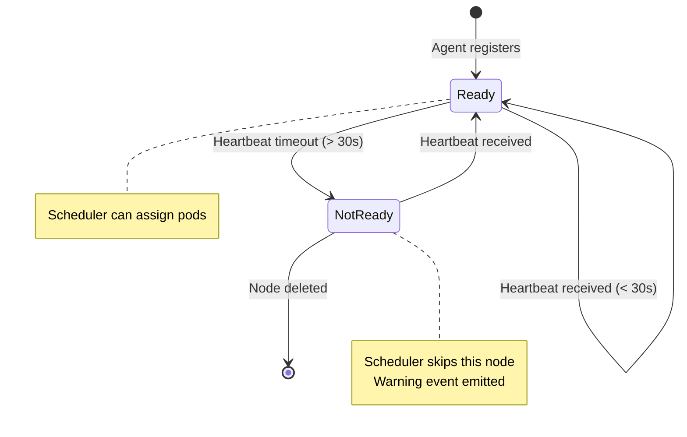

### Health Check Timeline

```mermaid
gantt
    title Node Health Monitoring Timeline
    dateFormat ss
    axisFormat %Ss

    section Agent
    Heartbeat 1          :h1, 00, 1s
    Heartbeat 2          :h2, 10, 1s
    Heartbeat 3          :h3, 20, 1s
    Agent crashes        :crit, crash, 25, 1s

    section Node Controller
    Check (all ok)       :c1, 10, 1s
    Check (all ok)       :c2, 20, 1s
    Check (all ok)       :c3, 30, 1s
    Check (all ok)       :c4, 40, 1s
    Check (node NotReady):crit, c5, 56, 1s
```

### Event Flow

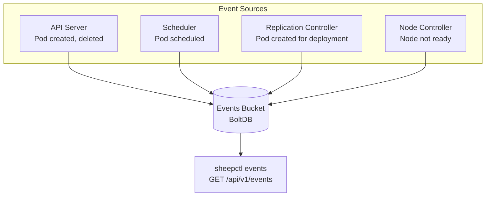

### Event Types

| Source | Type | Reason | Example Message |
|--------|------|--------|-----------------|
| API Server | Normal | Created | Pod web-0 created |
| API Server | Normal | Deleted | Pod web-0 deleted |
| Scheduler | Normal | Scheduled | Pod web-0 scheduled to node-1 |
| Replication Controller | Normal | Created | Created pod web-0 for deployment web |
| Node Controller | Warning | NodeNotReady | Node worker-2 heartbeat timeout |
